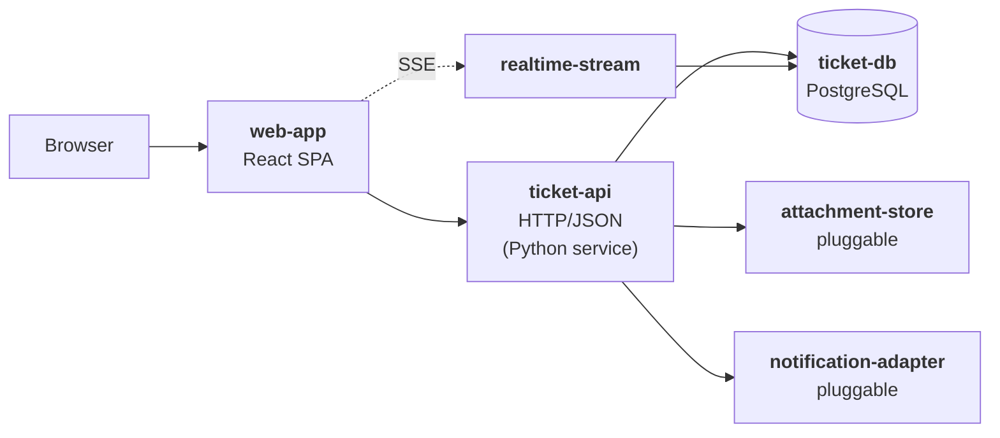

# EARS by Example — a React + Python + Postgres app

A second worked example, alongside the e-commerce storefront in
[EARS_example.md](EARS_example.md). That one is small on purpose. This
one is deliberately complex, and it exists to answer the question the
simple example dodges: **where does a mandated technology stack live in
an EARS specification?**

Short answer, up front: React, Python and Postgres are *not* internal
choices here, because the environment imposes them. They are captured
as **environmental requirements** in the Architecture, in the same
ordinary EARS grammar as everything else — see § The stack itself,
below. Everything they touch that is *not* imposed — component
structure, ORM, web framework, connection pooling, test layout — stays
out of the specification entirely.

---

## The app

**HelpDesk** — a multi-tenant support-ticket platform. Customers open
tickets from a portal; agents work them in a queue; tickets carry
attachments, threaded comments, SLA timers and a full audit trail;
supervisors see live queue state without reloading.

It is complex in the ways that matter for a specification: several
external boundaries, state that outlives any run, long-lived
connections, pluggable adapters, and hard isolation guarantees between
tenants.



### The interfaces

The Architecture names six external interfaces. "External" here means
*contractually stable*, not *user-facing* — the rule of thumb is
whether an independent party could write an implementation against the
contract ([User Interaction
Flow](docs/architecture/user-interaction-flow.md#what-belongs-in-the-architecture)).

| Interface ID | Type | Why it is external | Spec approach |
|---|---|---|---|
| `web-app` | Web GUI | User-facing | *(open gap in the taxonomy)* |
| `ticket-api` | Network service | User-facing contract | OpenAPI |
| `realtime-stream` | Network service | Separate contract — long-lived, server-push | OpenAPI / SSE schema |
| `ticket-db` | Persistent state | Outlives every run; needs an upgrade/rollback path | Schema + migration contract |
| `attachment-store` | Pluggable library | S3, MinIO or local disk must be swappable | WIT / adapter contract |
| `notification-adapter` | Pluggable library | Email, Slack or webhook must be swappable | WIT / adapter contract |

The two that surprise people are `ticket-db` and the two adapters.
Persistent state *is* an interface — the schema is a contract with
future versions of the system. And a boundary designed to be pluggable
is external even when it feels internal.

---

## The stack itself — environmental requirements

React, Python and Postgres are mandated by the deployment environment,
not chosen by the Building phase. That makes them environmental
requirements: ordinary EARS sentences, scoped project-wide rather than
to one interface.

| Pattern | Requirement |
|---|---|
| **Ubiquitous** | The web application shall be implemented in React with TypeScript. |
| **Ubiquitous** | The web application shall be composed from PatternFly components. |
| **Ubiquitous** | The API service shall be implemented in Python 3.12 or later. |
| **Ubiquitous** | The system shall use PostgreSQL 16 or later as its only persistent datastore. |
| **Ubiquitous** | Every deployable container image shall be built on a Red Hat Universal Base Image. |
| **Optional feature** | Where the deployment targets OpenShift, the system shall expose readiness and liveness probes on a port distinct from the API port. |

Two things to notice.

**The grammar does not mark these as different.** "The API service
shall be implemented in Python 3.12 or later" is the same ubiquitous
pattern as "the ticket API shall reject unauthenticated requests." What
separates them is metadata — a project-wide selector instead of an
interface ID — not wording. This is the whole of the categorization
story; see § How these are categorized.

**The line is *imposed from outside*, not *technical*.** "Python 3.12"
is in the specification because someone outside the project decided it.
"FastAPI rather than Django" is not, unless someone outside the project
decided that too. The test is provenance, not how technical the
sentence sounds.

---

## Requirements per interface

### `web-app` — the React SPA

| Pattern | Requirement |
|---|---|
| **Ubiquitous** | The web application shall render every ticket timestamp in the viewer's configured time zone with an explicit UTC offset. |
| **Event-driven** | When an agent submits a comment, the web application shall display the comment in the ticket thread within 200ms of the API acknowledging it. |
| **State-driven** | While the realtime stream is disconnected, the web application shall display a reconnecting indicator and disable the ticket-assignment control. |
| **Unwanted behavior** | If the API returns 401 for any request, then the web application shall discard the cached session and route the user to the sign-in view without losing unsent draft text. |
| **Optional feature** | Where the tenant has enabled satisfaction surveys, the web application shall present a rating prompt on the ticket view after the ticket enters `resolved`. |
| **Complex** | While a ticket is open in the editor, when another agent saves a conflicting change, the web application shall present both versions and shall not overwrite either without an explicit user choice. |
| **Ubiquitous** | The web application shall meet WCAG 2.1 Level AA on the queue, ticket-detail and ticket-creation views. |

Note what is absent: no component tree, no state-management library, no
routing scheme, no bundler. Those are Building's, and they change
without the specification changing.

### `ticket-api` — the Python HTTP service

| Pattern | Requirement |
|---|---|
| **Ubiquitous** | The ticket API shall scope every response to the tenant identified by the caller's access token. |
| **Ubiquitous** | The ticket API shall accept and return all timestamps as RFC 3339 strings in UTC. |
| **Event-driven** | When a customer submits a ticket, the ticket API shall assign it a tenant-unique reference, place it in `new`, and return the reference within 500ms at the 95th percentile. |
| **Event-driven** | When an agent claims a ticket, the ticket API shall transition it to `in-progress` and record the claiming agent, the timestamp and the prior state in the audit trail. |
| **State-driven** | While a ticket is in `resolved`, the ticket API shall reject comment submissions from any principal other than the ticket's reporter. |
| **Unwanted behavior** | If a request carries a tenant identifier that does not match the access token, then the ticket API shall return 403 and shall not disclose whether the requested resource exists. |
| **Unwanted behavior** | If a ticket update is submitted with a stale version identifier, then the ticket API shall return 409 with the current version and shall not apply the update. |
| **Optional feature** | Where a tenant has configured an SLA policy, the ticket API shall return the remaining time to breach on every ticket representation. |
| **Complex** | While a ticket is in `in-progress`, when its SLA timer expires and no agent has responded, the ticket API shall raise the ticket's priority one level and record the escalation in the audit trail. |

### `ticket-db` — the PostgreSQL schema

Persistent state is an interface, so it gets requirements of its own —
about the *contract*, not about the table layout.

| Pattern | Requirement |
|---|---|
| **Ubiquitous** | The ticket database shall retain every ticket state transition as an append-only audit record that no application role may update or delete. |
| **Ubiquitous** | The ticket database shall enforce tenant isolation at the database layer, such that no application role can read rows belonging to another tenant. |
| **Ubiquitous** | Every schema change shall be delivered as a migration that is reversible without data loss for one release. |
| **Event-driven** | When a migration is applied, the system shall record its identifier, checksum and completion time in a migration history table. |
| **State-driven** | While a migration is in progress, the API service shall continue to serve read requests against the previous schema version. |
| **Unwanted behavior** | If a migration fails partway, then the system shall roll the transaction back and leave the recorded schema version unchanged. |

The isolation requirement is the interesting one, and it is the file's
one legitimate use of `implementation-aware` verification — see below.

### `realtime-stream`

| Pattern | Requirement |
|---|---|
| **Ubiquitous** | The realtime stream shall deliver only events belonging to the subscriber's tenant. |
| **Event-driven** | When a ticket's state, assignee or priority changes, the realtime stream shall emit an event to every subscriber entitled to see that ticket within 2 seconds. |
| **State-driven** | While a subscriber is connected, the realtime stream shall emit a keep-alive at least every 30 seconds. |
| **Unwanted behavior** | If a subscriber reconnects with a last-seen event identifier, then the realtime stream shall replay every missed event in order, or signal that the backlog is no longer available. |

### `attachment-store` and `notification-adapter`

Pluggable boundaries need a contract precise enough for a third party to
implement.

| Pattern | Requirement |
|---|---|
| **Ubiquitous** | The attachment store shall address every object by a content hash that is stable across implementations. |
| **Event-driven** | When an attachment upload completes, the attachment store shall return a durable object reference that remains resolvable for the tenant's retention period. |
| **Unwanted behavior** | If an attachment exceeds the tenant's configured size limit, then the ticket API shall reject the upload before any bytes are persisted and shall name the limit in the error. |
| **Optional feature** | Where virus scanning is enabled, the ticket API shall withhold an attachment from download until the scan reports clean. |
| **Event-driven** | When a ticket is assigned, the notification adapter shall deliver one notification to the assignee, and shall not deliver a duplicate if the same assignment is replayed. |
| **Unwanted behavior** | If the notification adapter cannot deliver a notification, then it shall report the failure to the ticket API and shall not block the ticket's state transition. |

---

## Requirement records, with metadata

An interface-scoped requirement — normal case, default verification:

```json
{
  "id": "REQ-TICKET-012",
  "applies_to": {
    "interfaces": ["ticket-api"],
    "scopes": ["ticketing", "concurrency"]
  },
  "verification": {
    "mode": "isolated-interface"
  },
  "type": "unwanted-behavior",
  "text": "If a ticket update is submitted with a stale version identifier, then the ticket API shall return 409 with the current version and shall not apply the update.",
  "provenance": "user-authored",
  "created": "2026-08-31T10:05:00Z"
}
```

A project-wide environmental requirement — the mandated stack, in the
form it actually takes:

```json
{
  "id": "REQ-ENV-003",
  "applies_to": {
    "project": true,
    "scopes": ["environment", "runtime"]
  },
  "verification": {
    "mode": "isolated-interface"
  },
  "type": "ubiquitous",
  "text": "The API service shall be implemented in Python 3.12 or later.",
  "provenance": "user-authored",
  "created": "2026-08-31T10:05:00Z"
}
```

The one requirement that cannot be verified from the outside, with the
rationale the mode demands:

```json
{
  "id": "REQ-DB-002",
  "applies_to": {
    "interfaces": ["ticket-db"],
    "scopes": ["multi-tenancy", "security"]
  },
  "verification": {
    "mode": "implementation-aware",
    "rationale": "Tenant isolation is a property of the database's access control, not of any API response. An API-level test can show that the current endpoints do not leak; it cannot show that no future query can. Verification therefore inspects the enforcement mechanism directly."
  },
  "type": "ubiquitous",
  "text": "The ticket database shall enforce tenant isolation at the database layer, such that no application role can read rows belonging to another tenant.",
  "provenance": "user-authored",
  "created": "2026-08-31T10:05:00Z"
}
```

`implementation-aware` is the exception, not a convenience. It requires
a rationale in the requirement or change-set metadata and activates the
compensating gates defined in Phase 3.

---

## What did *not* become a requirement

Same app, and the sentences a reviewer sends back — grouped by why.

**Internal structure, on all three tiers:**

- ✗ *The web application shall keep queue state in a Redux store.*
  State management is Building's choice. What the specification owes is
  the *behavior* — "while the realtime stream is disconnected, the web
  application shall display a reconnecting indicator" — which holds
  whichever store is used.
- ✗ *The `TicketRepository` class shall use SQLAlchemy's async session.*
  Internal decomposition plus a library choice, and the class name is
  IdeaBot's lesson #1 arriving on schedule.
- ✗ *The API shall be built with FastAPI.* Python is mandated; the
  framework is not. If it genuinely is mandated, say so — and then it is
  an environmental requirement like the others, on the strength of who
  imposed it, not how it is phrased.
- ✗ *The tickets table shall have a `status` column of type
  `VARCHAR(32)`.* Column-level design is Building's. The contract is
  the observable one: which transitions exist, and that the audit trail
  is append-only.

**Not verifiable:**

- ✗ *The queue view shall be responsive.* Rewrite as: *When an agent
  opens the queue view for a tenant with 10,000 open tickets, the web
  application shall render the first page within 1 second at the 95th
  percentile.*
- ✗ *The API shall scale.* Rewrite as a concrete load and latency
  statement, or drop it — a prototype for a demo may honestly not need
  one.

**Not a pattern at all:**

- ✗ *Agents should be able to bulk-close tickets.* No `shall`, no
  trigger, no verifiable response. Rewrite as: *When an agent submits a
  bulk-close request for up to 100 tickets, the ticket API shall close
  every ticket the agent is entitled to close and shall return the
  identifiers it did not close, with a reason for each.*

**Right idea, wrong layer:**

- ✗ *The system shall cache tenant settings in Redis for 5 minutes.*
  An internal optimization — unless Redis is imposed by the
  environment, in which case it is an environmental requirement and the
  cache duration still is not one.

---

## How these are categorized

The EARS pattern is a sentence shape, not a taxonomy. Nothing in the
grammar says whether a requirement is functional, non-functional,
business or technical. Classification comes from metadata:

| Axis | Field | Values |
|---|---|---|
| **Scope** | `applies_to` | interface IDs (`ticket-api`, `ticket-db`, …), or an explicit project-wide selector for environmental requirements; optional narrower `scopes` |
| **Verification** | `verification.mode` | `isolated-interface` (default), or `implementation-aware` with a rationale |
| **Sentence shape** | `type` | one of the six patterns |

Applied to this app, the axis does all the work the words "functional"
and "non-functional" would have done, and does it machine-queryably:

| Requirement | Scope | Would traditionally be called |
|---|---|---|
| "When an agent claims a ticket, the ticket API shall transition it to `in-progress`…" | `ticket-api` | functional |
| "…shall return the reference within 500ms at the 95th percentile" | `ticket-api` | performance |
| "The ticket API shall return 403 and shall not disclose whether the requested resource exists" | `ticket-api` | security |
| "The web application shall meet WCAG 2.1 Level AA…" | `web-app` | accessibility |
| "The API service shall be implemented in Python 3.12 or later" | project-wide | environmental/technical |
| "The ticket database shall enforce tenant isolation at the database layer" | `ticket-db` | security + architectural |

Every row is the same grammar. The middle column is the only thing that
tells them apart — and it is the column tooling can query, which the
traditional labels never were.

### Coverage

A useful sanity check on a specification is that every pattern appears
where it should, and that no interface is specified only in the happy
case:

| Interface | Ubiq. | Event | State | Optional | Unwanted | Complex |
|---|:-:|:-:|:-:|:-:|:-:|:-:|
| `web-app` | ✓ | ✓ | ✓ | ✓ | ✓ | ✓ |
| `ticket-api` | ✓ | ✓ | ✓ | ✓ | ✓ | ✓ |
| `ticket-db` | ✓ | ✓ | ✓ | — | ✓ | — |
| `realtime-stream` | ✓ | ✓ | ✓ | — | ✓ | — |
| `attachment-store` | ✓ | ✓ | — | ✓ | ✓ | — |
| `notification-adapter` | — | ✓ | — | — | ✓ | — |
| project-wide | ✓ | — | — | ✓ | — | — |

An empty **Unwanted behavior** column is the one to worry about: it
means nobody has said what happens when the thing fails, and the
Building phase will decide silently.

`ears-manager check` enforces three things: the statement matches one of
the six patterns; at least one applicability selector is present
alongside the pattern field; and `verification.mode` is declared, with
`implementation-aware` requiring a rationale. Missing fields are
rejected. See [Components](docs/architecture/components.md).

---

**References:**

- [EARS by Example](EARS_example.md) — the smaller e-commerce walkthrough
- [Overview](docs/architecture/overview.md) § EARS: The Requirements Format
- [User Interaction
  Flow](docs/architecture/user-interaction-flow.md#what-belongs-in-the-architecture)
  — the boundary table, and the interface-type taxonomy
- [Alistair Mavin's EARS page](https://alistairmavin.com/ears/)
- Mavin, A., Wilkinson, P., Harwood, A. & Novak, M. (2009). "Easy
  Approach to Requirements Syntax (EARS)." *Proceedings of the 17th
  IEEE International Requirements Engineering Conference*, pp.
  317–322. DOI: 10.1109/RE.2009.9
