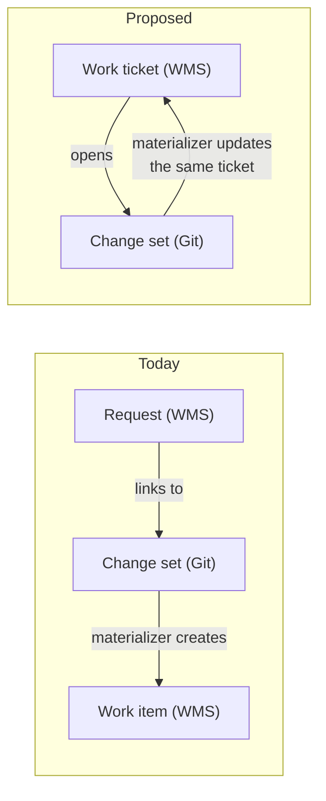
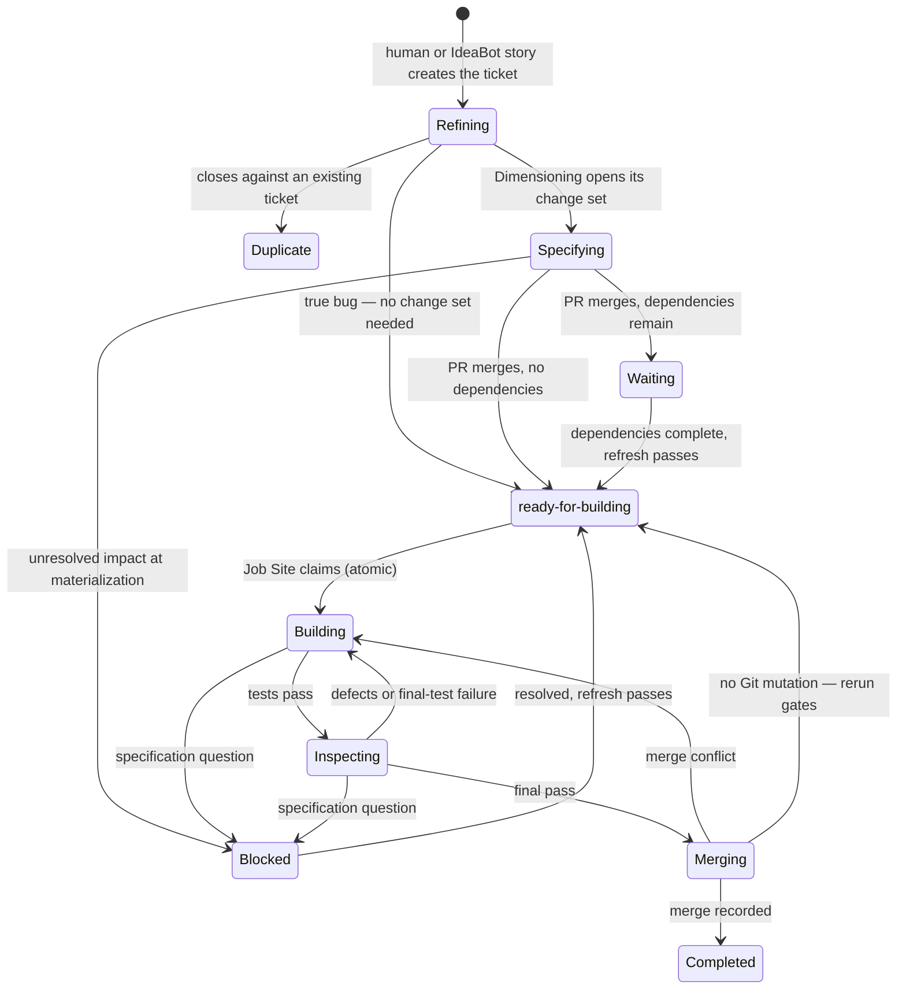

# Lukas feedback

## Summary

1. [No WMS backend can be run locally](#1-no-wms-backend-can-be-run-locally--for-single-player-or-for-developing-protobot) —
   Every WMS backend is an external product with no default named, so neither
   single-player use nor ProtoBot's own CI can run without a live tracker.
   Proposes an adapter conformance suite and a reference embedded adapter.
2. [Dimensioning has no exit criteria](#2-dimensioning-has-no-exit-criteria--add-a-testability-gate) —
   Nothing checks that an approved requirement is testable from the outside,
   so vague specs stall the autonomous phase. Proposes a testability rule, a
   mechanical contract-artifact check, and an isolated critic agent.
3. [One Dimensioning session becomes one work item](#3-one-dimensioning-session-becomes-one-work-item--add-a-delivery-plan-in-dimensioning-and-task-decomposition-in-the-job-site) —
   Work-item size is uncontrolled, so a greenfield first item is the whole
   Schematic in one agent's context. Proposes a delivery plan in Phase 2 and
   task decomposition inside the Job Site.
4. [Deviations from the plan have no home](#4-deviations-from-the-plan-have-no-home--add-an-infeasible-escalation-and-a-decisions-log) —
   The design has no path for a requirement that is infeasible as written and
   no readable record of build-time decisions. Proposes an "infeasible"
   escalation, a budget-exhausted outcome, and a per-item decisions log.
5. [One ticket, not two](#5-one-ticket-not-two--merge-the-request-and-the-build-work-item) —
   The request and the build work item duplicate five fields across two WMS
   records for one piece of work. Proposes merging them into one ticket that
   lives from intent to merge, with the change set staying in Git.
6. [The Sketch has no defined form](#6-the-sketch-has-no-defined-form--sketchings-output-vision-architecture-interfaces-is-unspecified) —
   Sketching's outputs (Vision, Architecture, interface records) have no
   format, schema, or default layout. Proposes naming the normative half,
   enumerating the interface record, and diagram-as-code as the default.
7. [The change set has no defined form](#7-the-change-set-has-no-defined-form--dimensionings-output-has-no-format-no-schema-and-no-example) —
   The manifest that the human review boundary approves has no serialization,
   ID scheme, schema version, or worked example anywhere. Proposes shipping
   one example plus a versioned, published schema.
8. [The Materializer has no defined form, and its placement reads two ways](#8-the-materializer-has-no-defined-form-and-its-placement-reads-two-ways) —
   The documents never say what the Materializer is as an artifact, and one
   mis-scoped sentence makes it read as part of the WMS Adapter. Proposes
   stating the artifact per deployment mode and fixing the wording.
9. [Requests and build work items share one WMS backend](#9-requests-and-build-work-items-share-one-wms-backend-and-nothing-says-how-a-backend-tells-them-apart) —
   Two record types live in the same tracker and nothing says how a backend
   tells them apart. Proposes a `record_type` field in ProtoBot's own model
   with a stated backend-mapping precedence.
10. [Refinement has no shape](#10-refinement-has-no-shape--no-phase-no-entry-mechanism-no-artifact-no-state-values--and-one-of-its-exits-leaves-the-process) —
    Refinement exists only as prose: no phase, no state values, no artifact,
    and the `contradicts` exit bypasses Dimensioning entirely. Proposes an
    explicit Intake step and routing every classification through Phase 2.

## 1. No WMS backend can be run locally — for single-player, or for developing ProtoBot

### The problem

The WMS is the control plane. Requirements stay stateless (`overview.md:245`), and
all mutable workflow state — what needs building, who claimed it, what is blocked —
lives in build work items behind the WMS Adapter. A Job Site cannot claim anything
without one, and single-player approval still has to materialize a work item:
"Direct push is not sufficient by itself" (`components.md:1687`). Nothing runs until
a backend is configured.

Every backend in the adapter table (`components.md:537-543`) is a separate product
that must be installed or subscribed to, and no default is marked. The Single-player
mode section (`components.md:1682`) names none. This leaves the
minimal-ceremony, no-cluster promise for solo use (`overview.md:153-157`)
unmet — Beads in the table is local and clusterless, but it is unnamed as a
default and covers only half the adapter API (see proposal 3).

**The sharper problem is developing ProtoBot itself.** The design principle at
`components.md:249-253` reads:

> The toolkit should be versioned alongside the WMS Adapter API it targets. Changes
> to EARS patterns, gap-closing heuristics, or the specification hierarchy should be
> testable independently of any particular Drafting Table implementation.

Three bullets above, the same list names the WMS Adapter one of "two runtime service
dependencies" (`components.md:246`). The principle then guarantees independence from
the Drafting Table and is silent on the WMS — the harder dependency to stand up. The
documents specify no test double, no reference implementation and no conformance
suite for the adapter contract. ProtoBot's own CI would have to run against a live
tracker.

### Proposal

In increasing order of effort:

1. **Extend the testability principle** (`components.md:249-253`) to say
   *independently of any particular Drafting Table implementation and any particular
   WMS backend*.
2. **Specify an adapter conformance suite.** The contract is already written
   precisely enough to test — idempotent create-or-return under a stable key, CAS
   claim writing owner/lease/fencing token, idempotent completion, append-only
   ledger events with expected-version checks, atomic finding decisions
   (`components.md:591-626`). Three of the five backends are hedged with "or an
   external coordinator" (`components.md:539`, `:541`, `:543`) and nothing says who
   proves they comply. A conformance suite is what makes the pluggability claim
   at `user-interaction-flow.md:212` checkable rather than aspirational.
3. **Ship a reference embedded adapter that passes the suite.** It serves three
   roles at once: CI backend for ProtoBot, local development backend, and the
   documented single-player default. Beads is evidence this is achievable — embedded
   Dolt in `.beads/`, no server, no account, offline, with a native atomic claim
   (`bd update --claim`, `bd ready`; `components.md:542`) — though it is positioned
   as agent memory ("a persistent, structured memory for coding agents"), not as a
   general work tracker, so it covers the coordination half of the adapter API and
   not the request/backlog half (`components.md:550`, `:587`).

### Correction to `related-work.md:381`

It describes Beads as "JSONL in git backed
by a version-controlled SQL database (Dolt)." Upstream states the reverse: the
embedded Dolt database is the source of truth, and `.beads/issues.jsonl` is "an
export for viewers and interchange, not the source of truth or a backup."
Cross-machine sync is `bd dolt push` / `bd dolt pull` against `refs/dolt/data`.
Irrelevant for single-player; it matters for multi-player, because work-item state
does not travel as ordinary committed files reviewable in a PR.

### Where it goes

| File | Lines | Change |
|:--|:--|:--|
| `docs/architecture/components.md` | 249–253, § Design principles | Testable independently of any WMS backend, not only of any Drafting Table. |
| `docs/architecture/components.md` | 545–576, § Responsibilities | Add the adapter conformance suite as a stated deliverable of the API. |
| `docs/architecture/components.md` | 537–543, adapter table | Add a reference embedded adapter row, marked as the default for single-player and CI; note which rows need an external coordinator to pass the suite. |
| `docs/architecture/components.md` | 1682–1689, § Single-player mode | Name the default backend; no account, no network. |
| `docs/architecture/related-work.md` | 381 | Fix the Dolt/JSONL ordering. |
| `docs/architecture/open-questions.md` | § new | What does the request/backlog half of the adapter API require of a backend, and may it be a different system from the coordination store? |

## 2. Dimensioning has no exit criteria — add a testability gate

### The problem

The whole design rests on one bet: the approved EARS requirements are
enough for Worker A to write tests without ever seeing the code
(`user-interaction-flow.md:362-366`). If a requirement is not testable
from the outside, the bet does not pay.

Nothing checks that it is.

- **Phase 1 has exit criteria. Phase 2 does not.** Sketching ends with
  "User has approved a Vision statement and an Architecture that
  enumerates all external interfaces and their types"
  (`user-interaction-flow.md:192`). Dimensioning — the phase the docs
  call the primary human review boundary — ends with an approved change
  set and no stated bar for what makes a requirement finished. The
  sequence diagram loops "Until interface is fully specified"
  (`user-interaction-flow.md:271`), but "fully specified" is never
  defined.
- **`ears-manager check` validates form, not substance.** It checks EARS
  pattern match, required fields, applicability selectors, verification
  mode, referential integrity, and file format
  (`components.md:387-415`). All of that is grammar. "When a user logs
  in, the system shall issue a token" passes every one of those checks
  and is still untestable — nobody knows the entry point, the flow, or
  the observable result.
- **Validation Rules do not fill the gap either.** They are explicitly
  scoped to workflow lifecycle, and the readiness check is "are all
  requirements *approved*" (`components.md:1070-1071`, `1108-1112`) —
  approved, not testable.
- **Interfaces can be approved with no contract at all.** The
  interface-type taxonomy already marks REPL, Web GUI and Native GUI as
  open gaps with no IDL (`user-interaction-flow.md:103,105,106`), and
  CLI as unevaluated (open question #18). Referential integrity only
  requires that a requirement name an interface *defined in the
  Architecture* (`components.md:402-407`) — not that the interface
  carries a registered contract artifact. So a change set can be
  approved for a web UI whose contract format is an admitted unsolved
  problem, and nothing in the pipeline says a word about it until a
  Worker stalls.

### What happens today when a requirement is not testable

The design does have a net: Building moves the work item to `blocked` on
a specification question (`user-interaction-flow.md:1032`), and undefined
behavior blocks and escalates to the user (open question #2, marked
decided). So nothing wrong gets built.

But the net is a net, not a gate. The cost is paid at the most expensive
point — after materialization, after dispatch, after a Worker has
started — and it comes back as an escalation, a linked change set, a
contract refresh and a re-dispatch. The docs already treat this frequency
as a metric worth measuring: "How often does the Job Site or Inspector
discover undefined behavior that Dimensioning should have caught?"
(`components.md:1530`). They measure it after the fact. They do not
prevent it.

The consequence in one line: **the autonomous phase is only as autonomous
as Dimensioning was complete.** A vague spec does not produce a wrong
prototype — it produces a stalled one.

### Proposal: one rule, one mechanical check, one cheap step

**a) State the rule, as Phase 2 exit criteria.**

> A requirement is finished when a tester who has never seen the
> implementation could write its test from the requirement, its
> interface contract, and nothing else.

This is the missing acceptance criterion, and it is exactly the
condition Worker A operates under. It belongs in Phase 2 in the same
form Phase 1 already uses.

**b) Make the mechanical half mechanical.** Extend `ears-manager check`
with one rule: every interface named by an approved requirement must
have a registered contract artifact of a known kind. The machinery
already exists — `ears-manager artifact put` registers interface IDLs
with a per-format validator (`components.md:377`, `408-412`); this only
adds "and a requirement may not be approved against an interface that
has none." Where the interface type has no IDL format yet (web GUI,
REPL), approval requires an explicit recorded waiver naming what stands
in for the contract, so the gap is a decision in the change set rather
than a surprise in the Job Site.

**c) Add a dry-run test outline to Dimensioning — produced by an
isolated critic agent.** Before the user approves a change set, a
reviewer agent — not the agent that drafted the requirements — produces,
for each changed requirement, one line naming:

1. the **entry point** it would drive (URL and method, command line,
   function signature), and
2. the **observable result** it would assert.

The critic operates on Worker A's projection: the change set and the
interface contracts, not the Dimensioning session transcript. That
isolation is the point — a critic that sat in the drafting conversation
shares the drafter's silent assumptions (the Hyrum's-Law failure the
docs already warn about, `user-interaction-flow.md:283`) and will
green-light gaps it helped create. It mirrors the dual-model isolation
the design already uses between Worker A and Worker B.

If the critic cannot name both for a requirement, that is a finding:
the requirement goes back into the gap-closing loop, with a bounded
number of rounds so the actor-critic loop cannot spin forever (the same
non-convergence concern item 4 raises for Building). The critic's green
light is a **necessary condition, not the exit criterion**: the human
still approves the change set, with the critic's outline attached as
evidence — the review boundary stays human, the critic just supplies as
much proof as possible that Dimensioning is complete. A bare verdict
would give the human nothing to disagree with; the outline is the
artifact.

Structurally this adds no new component class: it is an **Inspector for
the Schematic**, doing to Phase 2 output what Inspectors already do to
Phase 4 candidates. Its findings could even be recorded as Finding
Ledger events (`components.md:1293-1326`), so spec-review and
code-review findings share one event model and one disposition workflow.

**Honest limitation:** (b) is enforceable, (c) is not. An agent — even
an isolated one — can write a plausible test outline for a bad
requirement. The value of (c) is that a human reads the outline, and a
wrong entry point is far easier to spot in a one-line test sketch than
in prose. It reduces escalations; it cannot eliminate them.

### Minor correction that caused this whole question

`user-interaction-flow.md:349` gives the event-driven example as *"When
user logs in, shall issue token"* — with no interface. Every other part
of the document insists a requirement without an applicability selector
is rejected (`components.md:394-401`), and the JSON example two
paragraphs above binds the same sentence to `"interfaces":
["api-gateway"]` (`user-interaction-flow.md:294`). The bare table entry
reads as if requirements float free of any interface, which is precisely
what makes readers ask "how can anyone test that?". Adding the interface
to the examples in that table — and in the PBT/example-based tables at
lines 534-556 — removes the confusion.

### Where it goes

| File | Lines | Change |
|:--|:--|:--|
| `docs/architecture/user-interaction-flow.md` | end of § Phase 2 (~254-353) | Add **Exit criteria** for Dimensioning, stating the testability rule. |
| `docs/architecture/user-interaction-flow.md` | 258-281, Phase 2 sequence diagram | Add the critic step before change-set approval: an isolated reviewer agent, on Worker A's projection, produces the dry-run test outline; findings loop back to gap-closing (bounded rounds); the human approves with the outline attached. |
| `docs/architecture/user-interaction-flow.md` | 346-353, 534-556 | Put the interface on the examples, matching the JSON example at line 294. |
| `docs/architecture/components.md` | 387-415, § What it validates | Add the rule: no approved requirement against an interface with no registered contract artifact; a typed waiver is the escape hatch. |
| `docs/architecture/open-questions.md` | § Interactive phase | Note that the testability bar is now decided, and that what serves as a "contract" for web GUI / REPL is the remaining part of open question #18. |

## 3. One Dimensioning session becomes one work item — add a delivery plan in Dimensioning and task decomposition in the Job Site

### The problem

One approved change set makes one work item
(`user-interaction-flow.md:147-155`, `components.md:1611`). The Job Site
may not split it — "the Job Site cannot silently change the reviewed
unit" — and splitting or combining is an open question
(`components.md:1693-1697`). So the size of the work an agent gets is
decided by how the human cuts the backlog: one request, one change set,
one work item (`user-interaction-flow.md:842-851`), and no step cuts a
Dimensioning session into several change sets. The end-to-end flow never
even shows where the grouping happens — the change set and the work item
first appear in a side note (`user-interaction-flow.md:17-66`, `308-313`).

For a new project that means the first work item is the whole Schematic:
one PR with one change-set manifest (`components.md:775-780`), "the
first work packages will likely be single PRs" (`overview.md:291-292`),
and nothing enforces the "handful of requirements" the incremental model
assumes (`user-interaction-flow.md:937-938`). Inside that item, one
Worker A and one Worker B each hold the whole item plus the full
Schematic in context (`user-interaction-flow.md:455-457`,
`components.md:1209-1212`), and the merge → test → triage loop "repeats
until all tests pass" with no bound (`user-interaction-flow.md:413-421`).

Related Work already records the countermeasure and calls it a key
concept for ProtoBot — Beads restarts agents after each small task to
keep them near the start of the context window
(`related-work.md:410-414`); SqueakyClean runs many small agents under a
module-level manager (`related-work.md:426-432`) — and Phase 3 applies
none of it.

### What already exists

Every piece is in the design; only the step that uses them is missing.
The change set is already the grouping container
(`user-interaction-flow.md:108-116`); requirements carry `depends-on`
relationships with a cycle check in `ears-manager compare`
(`user-interaction-flow.md:859-866`); work items carry dependencies and
priority (`user-interaction-flow.md:880-884`, `1061`); the Job Site
already schedules concurrent `wi/` branches with WIP limits and conflict
avoidance (`components.md:839-841`, `856-863`); `.protobot/policy.yaml`
holds reviewed policy (`components.md:737`). And the design states its
own rule for splitting: it "requires a separately reviewed delivery plan
and a new impact assessment at the chosen source specification commit"
(`user-interaction-flow.md:148-152`).

### Proposal: split at two levels

Two mechanisms, complements at different granularities — not rivals.

**a) Macro split — a delivery plan step in Phase 2.** In the Phase 2
sequence (`user-interaction-flow.md:258-281`), after impact analysis and
before approval, the agent proposes a **delivery plan**: an ordered list
of planned change sets, each naming the requirement IDs it delivers, one
interface where possible, its dependencies, a one-line rationale, and a
size under a `.protobot/policy.yaml` limit (for example
`max_requirements_per_work_item`). The user reviews the plan with the
Schematic delta. On approval, `ears-manager` writes one manifest per
planned change set, each with its own impact assessment at the same
specification commit — exactly the "separately reviewed delivery plan"
the design asks for. The merge hook materializes one work item per
manifest, plan dependencies become work-item dependencies, and the Job
Site contract does not change. This is the only design-legal route to
multiple work items, and it buys parallel `wi/` branches, incremental
merges and failure isolation through machinery that already exists.

It also gives Phase 2 the exit criteria it lacks, in the form Phase 1
uses: every changed requirement passes item 2's testability rule and
belongs to exactly one planned change set, the plan has no dependency
cycle, and no planned change set exceeds the size limit. And it is not a
revived Feature container (`components.md:1644-1647`): the plan owns
nothing — it is an ordering of change sets at one specification commit
(`user-interaction-flow.md:114-116`).

**b) Micro split — task decomposition inside the Job Site.** After the
claim and before Worker dispatch, the Job Site orders the item's
requirements into tasks, gives each task a fresh Worker A and Worker B
pair, bounds the loop per task, and commits each task on the `wi/`
branch. The contract — the work item — does not change, only the order
in which it is met, so no new impact review is needed and no Phase 2 UX
changes. This is the Beads restart rule and SqueakyClean's tier B
applied to Phase 3: each Worker pair starts near the top of its context
window instead of dragging the whole item through one. Because it
touches no contract, it is arguably the better *first* implementation.

Neither replaces the other. (b) alone leaves the item one merge unit and
one completion unit — the greenfield first item still merges as one
giant change, and if task 7 of 10 is stuck, tasks 1–6 deliver nothing.
Parallel tasks *within* one item would mean rebuilding the scheduler
inside it, which is why (b) runs tasks sequentially. (a) alone still
hands one Worker pair an entire item's context. Together, (a) sets the
item size and buys concurrency; (b) keeps each agent's context small.

**The output stays EARS requirements, not user stories.** Worker A
writes tests from EARS with no code in sight
(`user-interaction-flow.md:362-366`); "as a user I want to log in" gives
it nothing to assert — the same reason the design rejected Gherkin
(`overview.md:123-129`) — and TransferBot hands over specifications, not
tickets (`overview.md:44-46`). A planned change set is what a story is
once the prose is removed: requirement IDs, a rationale, a priority and
an order.

### Honest limitation

The size limit is a proxy — ten tightly coupled requirements are harder
than thirty independent ones, and heavily coupled requirements will not
parallelize well wherever the split happens (the Job Site prefers
non-overlapping items, `components.md:856-863`). One interface per
planned change set is the better first cut; the right number is an eval
question, and the design already names Job Site cycle count as the first
metric to collect (`components.md:1552-1554`).

### Where it goes

| File | Lines | Change |
|:--|:--|:--|
| `docs/architecture/user-interaction-flow.md` | 17-66 | Add the change set and the work item to the end-to-end diagram and the phase list, so the reader sees where the grouping happens. |
| `docs/architecture/user-interaction-flow.md` | 258-281, Phase 2 sequence diagram | Add "Propose delivery plan" and "Review plan" after impact analysis, before approval. |
| `docs/architecture/user-interaction-flow.md` | end of § Phase 2 | Add **Exit criteria**: testability (item 2) plus plan completeness, acyclicity and size. |
| `docs/architecture/user-interaction-flow.md` | 147-155 | State that the reviewed delivery plan is a Phase 2 output, not a future exception. |
| `docs/architecture/user-interaction-flow.md` | 369-421, Phase 3 sequence | Add the task decomposition step: tasks ordered after the claim, a fresh Worker pair and a bounded loop per task, each task committed on the `wi/` branch. |
| `docs/architecture/components.md` | 417-431, manifest contents | Record the plan ID, the position in the plan, and planned-change-set dependencies. |
| `docs/architecture/components.md` | 737, `.protobot/policy.yaml` | Add the size limit. |
| `docs/architecture/components.md` | 775-780, 1611 | "a change-set manifest" becomes "one manifest per planned change set". |
| `docs/architecture/components.md` | 1693-1697 | Close the split/combine question with the two mechanisms: the delivery plan (a) in Dimensioning, task decomposition (b) in the Job Site. |
| `docs/architecture/open-questions.md` | #3 | Fold multi-interface orchestration into the delivery plan. |

## 4. Deviations from the plan have no home — add an infeasible escalation and a decisions log

### The problem

Dimensioning is done with some confidence, not certainty. During
Building the reality can differ: a requirement turns out impossible as
written, two requirements collide, a design choice the spec never
constrained has to be made. The design handles the cases where the
**spec is missing something** — undefined behavior, spec gaps, missed
impact — and routes them back to Dimensioning with the reason kept in a
change set or the Finding Ledger. It has no path for the case where the
**spec is wrong**, and no record for the case where the **spec is
silent on purpose**:

| Deviation | What the design does | Where the reason is kept |
|:--|:--|:--|
| Requirement infeasible as written — a bound the mandated base image cannot meet, requirements that conflict at build time | Nothing. Building exits only on "tests pass" or "specification question" (`user-interaction-flow.md:1031-1032`); the loop "repeats until all tests pass" (`user-interaction-flow.md:413-421`) | Nowhere |
| The loop never converges — retry budget exhausted | A budget is named only inside triage feedback (`user-interaction-flow.md:424`) and open questions #10/#15. No lifecycle outcome | Nowhere |
| Internal design choice the spec does not constrain — storage engine, protocol, library | Left to Building by design (`user-interaction-flow.md:198-201`); "we don't read code" (`overview.md:62-63`) | Nowhere a human reads |
| Approach changed between cycles; test-side deviations | Commit trailers and ledger events (`components.md:1016-1018`, `1293-1326`); quarantine (`user-interaction-flow.md:410-411`) | Machine-readable audit only, no summary |

Three consequences: **TransferBot gets no reasons** — it receives
"specifications and test expectations" (`overview.md:44-46`), never why
the prototype is shaped the way it is. **The next agent starts from
zero** — the history is in git (`components.md:1532-1538`), but nothing
renders it as a narrative a fresh Worker can read; this is the
`HANDOVER.md` from the 19 Aug margin notes (`LUKAS-questions.md:67`).
And the **infeasible case is the dangerous one** — a Worker that cannot
meet a requirement can only burn the budget or take a shortcut, the
exact behavior Related Work warns about (`related-work.md:410-414`),
with mutation testing after the fact as the only defense.

### Proposal

**a) An "infeasible as specified" escalation.** A fourth defect category
beside the three at `user-interaction-flow.md:766-791`. Raised by a
Worker through the Feedback Sanitizer (requirement-level reasons are
already on its allowlist, `user-interaction-flow.md:423-425`) or an
Inspector; carries requirement IDs, a reason class and a
requirement-level explanation; blocks the work item and opens a
"changes" request with the explanation as rationale
(`user-interaction-flow.md:845-847`). Human dispositions: revise the
requirement, waive with rationale, or reject the claim — a rejected
claim returns to Building with claim and rejection on record. The
Finding Ledger already has the event model and routing
(`components.md:1293-1326`); this is one more category, not a new
component.

**b) A defined outcome for a spent budget.** Add `blocked` with reason
`budget-exhausted` to the work-item lifecycle
(`user-interaction-flow.md:1021-1040`), carrying the last triage
classification and the failing requirement IDs. The human raises the
budget, splits the item (item 3's plan), or revises the spec. This
closes the lifecycle half of open questions #10 and #15.

**c) A decisions log per work item.** One file,
`.protobot/attestations/decisions/<work-item>.md`, in the
`attestation-only` namespace (`components.md:741`). Worker B appends at
the end of each cycle; the Job Site appends at each state change. One
entry: cycle, requirement IDs, the decision, the alternatives rejected,
the reason, a class. The path is in Worker B's allowlist only
(`components.md:934-953`) — Worker A never sees it; Inspectors read it
with the candidate; it ships in the demonstration manifest
(`user-interaction-flow.md:807-814`) and so reaches TransferBot; the
next item's Worker B receives the completed logs of its dependencies —
that is the handover. Evaluability asks for "what decisions were made"
(`components.md:1512-1514`); this is that trace, in one place.

**d) Render the audit that already exists** *(nice-to-have)*. The
between-cycle deviations have the data; add a rendered **build history**
per work item, like the inspection report that lands on main
(`components.md:795-796`). No new storage, one more renderer.

### Honest limitation

An infeasible claim can be wrong or lazy — that is why (a) routes it to
a human, records rejections, and passes through the sanitizer. The
decisions log is self-reported: a narrative for people and the next
agent, not proof. The proof stays in the conformance evidence.

### Where it goes

| File | Lines | Change |
|:--|:--|:--|
| `docs/architecture/user-interaction-flow.md` | 766-791, § Defect routing | Add the fourth category, "infeasible as specified", with source, payload, effect and dispositions. |
| `docs/architecture/user-interaction-flow.md` | 648-675, Phase 4 diagram | Add the branch. |
| `docs/architecture/user-interaction-flow.md` | 1021-1040, lifecycle | Add `blocked` with reason `budget-exhausted`. |
| `docs/architecture/user-interaction-flow.md` | 894-931, provenance | Add a fourth source: agent-reported infeasible. |
| `docs/architecture/user-interaction-flow.md` | 805-837, demonstration artifacts | The decisions log and the build history join the manifest. |
| `docs/architecture/components.md` | 728-741, control namespace | Add `.protobot/attestations/decisions/`. |
| `docs/architecture/components.md` | 934-953, projections | Worker B's allowlist gains the log; Worker A's denies it. |
| `docs/architecture/components.md` | 1293-1326, Finding Ledger | New finding category with its routing. |
| `docs/architecture/components.md` | 1512-1514, Evaluability | Name the decisions log as the trace source for "what decisions were made". |
| `docs/architecture/overview.md` | 44-46 | TransferBot's handover includes the decisions log. |
| `docs/architecture/open-questions.md` | #10, #15 | Note that the budget outcome is now defined; what remains is the budget size per operator and per triage class. |

## 5. One ticket, not two — merge the request and the build work item

### The problem

One piece of work creates two WMS records: the **request**, created before
Dimensioning (`user-interaction-flow.md:845-847`, `853-863`), and the **build
work item**, created by the materializer at approval
(`components.md:1605-1614`), joined 1:1 through the change set in Git
(`components.md:589-590`, `:1611`). The two records repeat each other: intent,
business priority, relationships, change type and affected scope are each
stored two or three times, kept equal by copying
(`user-interaction-flow.md:883`).

The three-record model is declared deliberate
(`user-interaction-flow.md:842-843`), but the intents the documents actually
defend — requirements carry no workflow state (`overview.md:245-249`), the
change set is the PR-reviewed audit unit in Git
(`user-interaction-flow.md:110-116`), the contract is complete and atomically
claimable (`components.md:553-556`) — all concern *other* splits. No document
says why the request and the work item must be two records in the same
tracker: the "Why this split" table (`components.md:806-815`) never mentions
requests (item 9's observation). And the duplication is exactly the "overlap
and ambiguity between tickets" the design's own IdeaBot lesson warns against
(`related-work.md:99-104`).

What follows from the split:

- **Nothing moves a request into Dimensioning.** Blocked items get a
  pull-on-session-start rule (`components.md:152-155`); requests get only the
  passive "the request enters at Phase 2" (`user-interaction-flow.md:975`).
- **The first build has no request at all** (`user-interaction-flow.md:971`) —
  even though IdeaBot's output is already a Jira Story
  (`hermes/docs/decisions/0016-jira-field-mapping-for-idea-dashboard.md:35-36`)
  the design never connects.
- **The request's prose has no decided home** — the WMS holds an
  "intent/rationale reference" (`components.md:550-551`), the manifest "user
  intent" (`components.md:423`); which one holds the text is unstated.
- **A tracker reader sees two tickets for one feature**, and neither is
  readable — the work item holds IDs and commits only (`components.md:591-595`).
- **The PR can never link the record that tracks the build.** The work item is
  created only after merge (`components.md:1582-1614`), so at review time the
  PR can link only the request — a record the work item supersedes — and after
  merge the durable record has no presence in the PR. The traceability the
  design advertises (`components.md:1651-1654`) runs backwards from the WMS; a
  reader on the PR has no forward path to the ticket.

### Proposal

Merge the request and the build work item into **one WMS ticket** that lives
from intent to merge. The change set and the requirements stay in Git — PR
review remains the approval gate; only the coordination plane changes.

The lifecycle is the design's own work-item states
(`user-interaction-flow.md:1021-1040`) with two refinement states in front —
and every failure exit the design has today kept:

Who writes what: creation (human, agent, or the IdeaBot handoff — the Jira
Story **is** the first ticket, closing the no-request gap) sets intent,
priority and relationships; Dimensioning adds the change-set ID to the ticket
and the ticket ID to the PR — PR ↔ ticket becomes one stable, bidirectional
link, valid at review time and for the life of the work; the
materializer's merge hook writes the frozen contract plus a **rendered
body** — title, each changed requirement's text at the frozen commit, links to
the `wi/` branch and the manifest, marked "convenience view — canonical is the
manifest" (`user-interaction-flow.md:814`); the Job Site's execution writes
(lease, fencing token, contract versions) are unchanged. The materialization
key becomes ticket ID + change-set ID, preserving idempotency — and since both
exist at PR time, CI can verify the PR declares its ticket before the merge
hook fires; today's key only exists after merge (`components.md:465-470`).
With item 3's
delivery plan, one parent ticket owns one child ticket per planned change set.

What the two-record split protects, the ticket keeps:

| Protection | With one ticket |
|:--|:--|
| A request can end with no build (`user-interaction-flow.md:868-878`) | States `duplicate` and the true-bug shortcut to `ready` |
| The spec delta is PR-reviewed | Unchanged — the change set stays in Git |
| Complete-at-birth: "dispatch must never observe a partial item" (`components.md:553-556`) | Guaranteed by state instead of record existence — `ready-for-building` stays the only claimable state. No new backend capability: CAS updates are already required for claims |
| One change set → many work items, some day (`components.md:1693-1697`) | Child tickets; Jira sub-tasks and Beads dependency links both exist |

**Honest limitation.** The ticket mixes a mutable half (refinement) with an
append-only half (the contract), so the adapter must treat contract fields as
never human-editable, reconciling over manual edits — and the reconciler,
which today can rebuild a work item from the Git manifest alone
(`components.md:1624-1627`), gains a rule: recreate the ticket if a human
deleted it. Escalation-created change sets (`user-interaction-flow.md:918-924`)
still need their own ticket — though under this model the Job Site's
escalation issue (`components.md:1666-1668`) naturally *is* that ticket,
linked as a dependency of the blocked one.

### Where it goes

| File | Lines | Change |
|:--|:--|:--|
| `docs/architecture/overview.md` | 210-217, terminology table | Merge the Request and Build work item rows into one "Work ticket" entry. |
| `docs/architecture/user-interaction-flow.md` | 840-891, § Request Backlog | Rewrite the three-record model as the ticket lifecycle; keep the change set as the Git-side record. |
| `docs/architecture/user-interaction-flow.md` | 1016-1083, § Work item lifecycle | Extend the state diagram with `refining` and `specifying`; name the trigger that moves a ticket into Dimensioning. |
| `docs/architecture/components.md` | 545-576, 577-627, WMS Adapter | One record type; materialization becomes an update of the existing ticket under the same idempotency key; fold the Requests API into the ticket API; add the rendered body to the translation duty (`components.md:559-560`). |
| `docs/architecture/components.md` | 761-770, storage diagram | Show one ticket with a readable body instead of the bare `WI-042` pointer. |
| `docs/architecture/overview.md` | 51-56, IdeaBot handoff | The IdeaBot story becomes the first ticket. |

## 6. The Sketch has no defined form — Sketching's output (Vision, Architecture, interfaces) is unspecified

### The problem

Sketching produces the Vision and the Architecture — the Drafting Table's job
is "producing the Sketch: Vision + Architecture" (`components.md:163`,
`179-181`) and `ears-manager artifact put` creates them (`components.md:377`) —
yet nothing in the five documents says what any of them looks like:

- **No format.** Vision and Architecture are "opaque prose or external IDLs"
  with delegated validation (`components.md:490-492`). Markdown, a draw.io
  file, and a PNG export are all equally legal; no diagram convention or
  format allowlist exists anywhere.
- **No default location.** `project.yaml` points at them "wherever project
  conventions put them" (`components.md:743-745`) — an adoption path for
  existing projects (`components.md:752-756`) that leaves the greenfield case,
  the primary scenario, with no default Sketch layout.
- **No interface schema.** Requirements have a fully enumerated record with
  "missing fields are rejected" (`components.md:394-401`); `ears-manager add
  interface` is one table row (`components.md:376`) with no stated record
  shape — yet requirement applicability selectors resolve against exactly
  these records (`components.md:403-405`).
- **Four of six interface types have no settled contract format.** Only
  network services (Smithy/OpenAPI) and linkable libraries (WIT) are settled;
  CLI "needs evaluation", REPL, Web GUI and Native GUI are open gaps
  (`user-interaction-flow.md:99-106`). A demo prototype is very often a web
  GUI — the interface type ProtoBot most needs to emit has no defined
  Architecture output.

The change-set operation vocabulary breaks down at this level: requirements
have `add`/`revise`/`retire` (`components.md:424-426`), interfaces have
`add`/`update` but no retirement (`components.md:376`, `384-385`), and
Architecture/Vision prose has only whole-artifact `artifact put`, recorded as
a digest (`components.md:377`, `408-412`). A digest says *that* a document
changed, never *how* — the contract-refresh trigger (`components.md:869-870`)
is change detection, not comprehension — so every architecture edit expressed
as a picture degrades to block-and-escalate. Two concrete consequences:
interface removal has no reviewed path (referential integrity catches the
dangling selectors afterwards, `components.md:403-407`), and quarantine
triggers only on requirement changes (`components.md:983`, `1213`), so an
interface change has no defined effect on the test catalog.

One mitigation is real and should be stated: the pipeline never reads the
picture — work items carry operations, requirement IDs, the spec commit and
intent (`user-interaction-flow.md:1052-1070`). An undiffable Architecture
cannot break Building; it can only drift.

### Proposal

**a) Say which half is normative.** The interface registry plus the interface
IDLs are the contract; Vision and Architecture prose are derived documentation
for humans. One sentence in § Required control namespace fixes it —
`components.md:743-745` currently encourages the opposite reading.

**b) Enumerate the interface record schema**, the way requirements are at
`components.md:389-401`: stable ID, interface type from the taxonomy, human
name, the registered contract artifact — or an explicit recorded waiver where
the type has no IDL format yet — and provenance.

**c) Extend the change-set operations to interfaces, symmetrically.**
`add`/`revise`/`retire` recorded in the manifest like requirement operations;
`retire` gains an interface form that forces the change set to disposition
referencing requirements; quarantine and contract refresh key off interface
operations too.

**d) Define a default Sketch format and layout for new projects**, keeping the
project-convention override for the adoption case it was written for: a
default layout registered in `project.yaml` at project creation (answering
`components.md:500-503` for greenfield only), and **diagram-as-code as the
default format** — Mermaid or PlantUML source, binary exports derived and
never registered — so the digest and `git diff` mean something. The lever
already exists: per-artifact validators (`components.md:377`, `408-412`) plus
`policy.yaml` (`components.md:736-737`) can express a format allowlist today.

**e) A drift check between the Architecture document and the interface
registry.** A derived document can show last quarter's interfaces
indefinitely; nothing checks the two agree. Either `ears-manager check` gains
that rule for the default text format, or the drift is accepted explicitly in
`open-questions.md` — silence is the one option that should not survive
review.

Honest limitation: (b), (c) and (e) are enforceable; (d) is a convention with
an override, which is fine — the point is that the *default* produces a
readable delta; and (a) only helps if (e) then keeps it honest.

### Where it goes

| File | Lines | Change |
|:--|:--|:--|
| `docs/architecture/components.md` | 728-756, § Required control namespace | State which half is normative (interface registry + IDLs) and which is derived documentation; give new projects a default registered layout for Vision, Architecture and interface contracts, with the project-convention override kept for existing projects. |
| `docs/architecture/components.md` | 387-415, § What it validates | Enumerate the interface record schema beside the requirement one; add the Architecture-vs-registry drift rule. |
| `docs/architecture/components.md` | 370-385, subcommand table | `ears-manager retire` gains an interface form that dispositions referencing requirements. |
| `docs/architecture/components.md` | 417-431, manifest contents | Record interface operations as `add` / `revise` / `retire`, not as an unnamed "interface/Architecture change". |
| `docs/architecture/components.md` | 736-737, `.protobot/policy.yaml` | Add the accepted-format allowlist for Architecture and interface artifacts; diagram-as-code as the default. |
| `docs/architecture/components.md` | 869-870, contract refresh | Key refresh off interface operations, not only off an artifact digest change. |
| `docs/architecture/components.md` | 983, 1213, quarantine | Trigger on a revised or retired interface as well as a requirement. |
| `docs/architecture/components.md` | 500-503, § Open design questions | Note the layout question is now answered for greenfield; what remains is the general/existing-project case. |
| `docs/architecture/user-interaction-flow.md` | 96-106, interface-type taxonomy | Say what stands in for a contract where the type has no IDL (REPL, Web GUI, Native GUI) — the recorded waiver from item 2(b). |
| `docs/architecture/user-interaction-flow.md` | 192-193, Phase 1 exit criteria | The Architecture must enumerate interfaces **as registry records with a registered contract artifact or a waiver**, so the criterion is machine-checkable. |
| `docs/architecture/user-interaction-flow.md` | 195-245, § What belongs in the Architecture | Say where environmental constraints physically live — Architecture prose, or project-selector requirements in the store. |
| `docs/architecture/user-interaction-flow.md` | 124-137, changed vs applicable | Extend the changed set to interface operations, so an architecture delta is as machine-readable as a requirement delta. |
| `docs/architecture/open-questions.md` | #7, #18 | Scope #7 to the requirement store now that the Sketch artifacts have a default; record the accepted-format decision and, if (e) is declined, the accepted Architecture drift. |

## 7. The change set has no defined form — Dimensioning's output has no format, no schema and no example

Item 6 asked this about Sketching's output; this is the same question one phase
later. They overlap in one place — item 6(c) asks for interface operations
*inside* the manifest, this item asks what the manifest itself looks like — and
can be raised as separate comments.

### The problem

The manifest's contents are enumerated once, in five bullets at
`components.md:421-431`, and nothing else in the five documents adds to them.
"Format-agnostic interface" is not a defense here: the manifest is the immutable
audit record the human review boundary approves and a PR reviewer reads, and it
is independent of the mutable requirement store — so "callers use subcommands,
not files" does not cover it. What is missing:

- **Serialization, granularity, naming, ID scheme.** `.protobot/change-sets/`
  is one table row (`components.md:739`) with no extension, layout or naming
  convention. The change-set ID is used as a defined thing (`components.md:466`,
  `:1606`) but is in no field list and allocated nowhere. The filename would be
  a fine answer — a path is already an identity in this design
  (`components.md:408-412`) — it just is not said.
- **No example, anywhere.** Not one sample manifest in the five documents; the
  only rendering is my own illustrative `CS-001` in
  `docs/scenarios/01-new-project.md:85`. One worked example would settle most of
  this item on its own.
- **Embedded or referenced content is undecided.** Whether a `revise` carries
  the before/after requirement text or only ID + digest decides whether an
  approved manifest is self-contained audit evidence or a pointer set that goes
  stale — and the design reserves the right to rewrite the store underneath it
  (`components.md:483-486`).
- **No schema version**, though `project.yaml` carries one (`components.md:735`)
  and manifests are immutable files read years later by a newer `ears-manager`.
- **Intent is not machine-comparable.** The decided contract-refresh policy
  triggers when "source change-set intent changed" (`components.md:869-870`);
  over free prose that check is undefined.
- **The record spans two systems, and nothing shows the join.** The merge
  commit deliberately lives in the WMS, not the manifest
  (`components.md:465-470`); no document renders the two halves together.

**And a CI gate already depends on all of it.** `ears-manager check` validates
"change-set integrity" for CI (`components.md:374`) against "the expected
schema" (`components.md:413-415`) — a schema written down nowhere. Nor is this
a deferred decision: open question #7 covers the *requirements store* format and
names change-set history only as an input (`open-questions.md:53-59`), not as a
question of its own.

### Proposal

**a) Ship one worked example.** A committed sample manifest: one `add`, one
`revise`, one `retire`, one applicable candidate, one `not-applicable`
disposition with rationale. The cheapest fix in the whole review.

**b) Name the serialization, granularity and ID scheme.** If the filename *is*
the ID, say so. Approved manifests are immutable and append-only, so this is
independent of the mutable store's format — it does not have to wait for open
question #7.

**c) Publish a versioned schema.** A `schema_version` field in every manifest
plus a machine-readable schema that the "change-set integrity" rule validates
against. Without it, the promised CI gate cannot be written.

**d) Decide embedded versus referenced, per operation.** Recommendation:
**both** — ID + digest for integrity, and the before/after text embedded, so
the manifest stays readable across a store migration and a mismatch is
detectable rather than silent. Only sound if `ears-manager check` enforces the
digest.

**e) Say how intent is compared.** A digest over the intent text — accepting
that a cosmetic edit refreshes contracts — is an acceptable answer, if stated.
This is the genuinely hard part; leaving it implicit puts an undefined
comparison inside a policy marked *decided*.

**f) Show the two halves together.** One paragraph or diagram in § Content
Storage Model rendering a complete change set: the Git manifest plus the WMS
record holding the change-set ID and merge commit.

### Where it goes

| File | Lines | Change |
|:--|:--|:--|
| `docs/architecture/components.md` | 417-431, § Change-set impact analysis | Add the manifest's serialization format, file granularity, ID scheme and `schema_version` beside the field list; state whether operations embed requirement text or only reference it. |
| `docs/architecture/components.md` | after 431 | Add one worked example manifest — add / revise / retire, one applicable, one not-applicable with rationale. |
| `docs/architecture/components.md` | 374, subcommand table | Say what `ears-manager check`'s "change-set integrity" validates against: the published manifest schema. |
| `docs/architecture/components.md` | 413-415, § What it validates | "The expected schema" needs to exist; pin the manifest's own format even while the requirement store's stays open. |
| `docs/architecture/components.md` | 739, § Required control namespace | `.protobot/change-sets/` gains the naming convention and file layout. |
| `docs/architecture/components.md` | 735, `project.yaml` | Record which schema versions are tracked there and which the manifest carries itself. |
| `docs/architecture/components.md` | 465-470 and 758-771, storage diagram | Render the Git manifest and the WMS merge-commit reference as the two halves of one change-set record. |
| `docs/architecture/components.md` | 869-870, contract refresh policy | Define how "source change-set intent changed" is evaluated. |
| `docs/architecture/user-interaction-flow.md` | 108-155, § Change sets and applicability | Name the manifest fields that hold the changed and applicable sets, and link the worked example, so Phase 2's output is concrete at the point the reader meets it. |
| `docs/architecture/open-questions.md` | #7 | Scope it explicitly to the requirement store, and record that the change-set manifest format is decided separately — being immutable, it need not follow the store. |

## 8. The Materializer has no defined form, and its placement reads two ways

### The problem

The Materializer is the component the whole autonomous half hangs off — it is
what turns an approved change set into the build work item the Job Site claims.
The five documents never say **what it is**: a service, a daemon, a CLI
subcommand, a library, a hook script. That word appears for other components and
not for this one:

- Validation Rules: "Not a running service; a shared library or rule set"
  (`components.md:105-107`), restated at `components.md:1081-1082`.
- `ears-manager`: "Statically linked Go binary… distributed as a single static
  binary with zero runtime dependencies" (`components.md:478-481`).
- Drafting Table: frontend plus agent harness, with the deployment target named
  per reference implementation (`components.md:125-142`).
- Materializer: nothing.

**What the documents do settle**, so this is not relitigated:

- It belongs to the **Job Site control plane**, not the WMS Adapter — stated at
  `components.md:112-114`, drawn inside the `Job Site trusted control plane`
  subgraph and outside the execution subgraph (`components.md:1149-1150`), and
  listed under § Internal structure as "Materializer/Dispatcher"
  (`components.md:1246-1248`).
- It is a **caller** of the adapter. The adapter only persists "the complete
  contract **already assembled by the Job Site Materializer** under a stable
  idempotency key" (`components.md:553-556`); contract construction appears
  nowhere in its responsibilities (`components.md:545-576`).
- It is a **credentialed identity**: "Only the Materializer, Integration/Merge
  service, and WMS control plane receive narrowly scoped actions"
  (`components.md:1802-1805`) — a principal with Git and WMS write scope, not
  code borrowing someone else's process.

**Four properties in the text constrain the artifact, and no sentence resolves
them:**

| Evidence | Implication |
|:--|:--|
| "A registration hook calls the Job Site materializer with the change-set ID, resulting merge commit, and stable materialization key" (`components.md:1605-1607`) | something inbound calls it — an endpoint, or a command a hook can exec |
| "This control-plane function runs independently of Worker capacity" (`components.md:1201-1202`) | its own lifecycle, not a step inside a build |
| "When that dependency completes, the materializer applies every pre-claim eligibility check" (`components.md:457-459`, `885-889`) | it acts later, unprompted — an event subscription or a polling loop |
| "ProtoBot must work without requiring an OpenShift/Kubernetes cluster" (`overview.md:153-157`) | the same component must also run on a laptop |

The single-player paragraph comes closest and stops short: "A local
`register-approved-change-set` command or hook performs the same idempotent WMS
materialization as the multi-player merge hook" (`components.md:1684-1688`).
That names an artifact for **one** of the four trigger paths. Nothing says what
runs the dependency-completion path on a laptop where no Job Site is up.

**Where the "is it part of the WMS Adapter?" reading comes from.** There is no
logical contradiction, but there is one mis-scoped sentence and one word
collision, and together they produce the confusion.

- **`components.md:174-177` is the mis-scoped sentence.** It is a bullet in the
  Drafting Table's § Interfaces describing the **DT → WMS Adapter** write, and
  it ends "The Materializer validates those inputs and performs the
  expected-state transition during contract refresh." Read literally that puts
  the Materializer behind the adapter, inside the Drafting Table's write path.
  Two things are wrong with it. First, the DT does not call the Materializer:
  it writes a resolution or change-set reference into the WMS, and the
  Materializer consumes it asynchronously at blocked-item resume
  (`components.md:889-895`) — that asynchrony is the actual mechanism and the
  bullet replaces it with a verb. Second, input validation is not the
  Materializer's job anywhere else in the design: Validation Rules are a shared
  library applied **by callers** for early feedback, with authoritative
  enforcement at the WMS API boundary (`components.md:1081-1094`), and the Job
  Site's own list says "Apply Validation Rules before writing state transitions
  to the WMS Adapter" (`components.md:1239-1240`).
- **"Materialization" names three different things at three layers**: an adapter
  API operation, pure persistence (`components.md:591-595`); a Job Site
  responsibility — resolve the manifest, rerun impact analysis, resolve
  dependencies, construct the contract (`components.md:1197-1202`); and a Job
  Site sub-component (`components.md:1246`). Any sentence using the noun is
  therefore ambiguous about which layer acts. Passive voice compounds it:
  "Approval atomically materializes a build work item" (`overview.md:151`),
  "The merge registration idempotently materializes a complete build work item"
  (`components.md:1558-1560`) — the actor is deleted in both.
- **A third actor appears unnamed.** The three contract-refresh contexts have
  three owners: pre-claim baseline refresh → "the Materializer"
  (`components.md:885`); blocked-item resume → "the control plane"
  (`components.md:889`); pre-merge revalidation → "an active Job Site with the
  current lease" (`components.md:896-899`). Whether the middle one is the
  Materializer is never said, and it is the one the Drafting Table's blocked-item
  resolution actually lands in.

**Placement versus lifetime — the part that does not fit.** The Materializer is
named a Job Site sub-component (`components.md:1246`), but its work precedes any
build: a work item must already exist before a Job Site can claim it. The two
halves bundled under one name have completely different trigger models —
materialization is event-driven from a Git hook (`components.md:1605-1607`),
dispatch is a pull loop against `ready-for-building`
(`components.md:1203-1208`) — and Workers and Inspectors hold no Git or WMS
mutation role at all (`components.md:1802-1803`), so they never touch either.
So the component filed inside "the autonomous execution engine"
(`components.md:110-114`) is the one part of it that must be alive when nothing
is executing.

### Proposal

**a) State the artifact, per deployment mode.** One paragraph in § Job Site →
Internal structure: is the Materializer a process with its own webhook endpoint,
a subcommand of a `protobot` binary that a hook execs, or a library linked into
one Job Site process — and what the answer is in single-player (laptop, no
cluster) versus multi-player (hosted). Everything else about this component is
over-specified relative to this one sentence. Include what runs the
dependency-completion refresh in single-player, since
`register-approved-change-set` only answers the merge-registration trigger.

**b) Split the name.** `Materializer/Dispatcher` bundles an event-driven half
and a polling half. Naming them separately makes (a) answerable independently
for each — the materializer half plausibly is a hook-invoked command; the
dispatcher half is a loop that has to be running.

**c) Rewrite `components.md:176`.** The Drafting Table interface bullet should
describe only the DT → WMS write, and state the asynchrony explicitly: the DT
submits the reviewed resolution to the WMS; the control plane consumes it at the
next contract refresh and performs the transition then. That single edit removes
the "is it inside the adapter?" reading.

**d) Give "materialize" one actor.** Rename the adapter's API operation
(`components.md:591-595`) to something like `create-or-return work item`, and
put the actor back into the passive sentences at `overview.md:151` and
`components.md:1558-1560`.

**e) Name the owner of blocked-item resume** at `components.md:889` — "the
control plane" is the only one of the three refresh contexts with no named
actor.

**Honest limitation.** (c), (d) and (e) are pure wording and cost nothing.
(a) may not be an omission
at all: the deployment shape of the Job Site is genuinely open — the bot account
model is already an acknowledged open question (`components.md:1698-1701`) — and
the honest answer may be "undecided". If so it belongs in `open-questions.md`,
written down as a question, rather than left for each reader to infer from four
scattered constraints. (b) is a naming change with a real cost: the two halves
share the WMS contract and the reconciler, and splitting the name should not
imply splitting the credential or the reconciliation path.

### Relevant files

| File | Lines | Change |
|:--|:--|:--|
| `docs/architecture/components.md` | 1244-1248, § Internal structure | Say what the Materializer is as an artifact, and what it is in each deployment mode. |
| `docs/architecture/components.md` | 174-177, Drafting Table § Interfaces | Describe only the DT → WMS write; state that the control plane consumes it at the next contract refresh. |
| `docs/architecture/components.md` | 591-595, adapter API | Rename the "Materialization" operation so the verb has exactly one actor. |
| `docs/architecture/components.md` | 889, contract-refresh policy | Name the actor for blocked-item resume. |
| `docs/architecture/components.md` | 1197-1208, § Responsibilities | Separate the materialization half from the dispatch half by name; note the different trigger models. |
| `docs/architecture/components.md` | 1558-1560 | Replace the passive "the merge registration idempotently materializes" with the actor. |
| `docs/architecture/components.md` | 1684-1688, § Single-player mode | Say what runs the dependency-completion refresh with no hosted Job Site. |
| `docs/architecture/overview.md` | 151 | Same passive-voice fix: name who materializes on approval. |
| `docs/architecture/open-questions.md` | § new, or beside the bot account model | If the deployment shape is undecided, record it as a question instead of leaving it to inference. |

## 9. Requests and build work items share one WMS backend, and nothing says how a backend tells them apart

### The problem

Two of ProtoBot's three records live in the same issue tracker. The **request**
is WMS-resident — "Store and retrieve request backlog metadata: intent/rationale
reference, human-owned business priority, owner, refinement state, and typed
request relationships" (`components.md:550-552`) — and so is the **build work
item** (`components.md:806-815`); only the **change set** escapes to Git. The
Adapter API even gives the two WMS records separate surfaces — **Requests**
(`components.md:587-590`) versus **Materialization** (`components.md:591-595`).

Yet the only record→backend mapping written anywhere, the adapter table at
`components.md:537-543`, maps exactly one record per row — "one issue per build
work item", "one card per build work item". There is no "one X per request" row,
no discriminator field, and no label convention: nothing says how a reader,
human or adapter, tells a request from a build work item once both are issues in
the same project. The "Why this split" table (`components.md:804-815`) confirms
the omission — it enumerates work items, specs, code, findings and evidence, and
never mentions requests.

Not every backend can carry two native record types (Jira can; Trello has no
type concept at all), so the design assumes a capability that is not uniformly
available. And a title-prefix convention cannot be the fallback source of truth:
lifecycle transitions compare an expected state atomically
(`components.md:596-602`), queries must work by "state, dependency, owner, or
idempotency key" (`components.md:603-604`), and a type encoded in a
human-editable title survives neither — anyone renaming a card silently
reclassifies it. `user-interaction-flow.md:872-873` already rejects that class
of inference: "never based on text similarity alone".

### Proposal

Extend the adapter contract the way `components.md:700-702` already does for
atomic claims ("It may use a backend primitive or an external coordinator, but
issue, ticket, or card assignment by itself is insufficient"):

1. **`record_type` is ProtoBot's own model field, always.** The adapter carries
   it in the domain model regardless of backend, so no component ever parses
   the backend's rendering to learn what a record is.
2. **Add a "Record type" column and the missing request rows to the adapter
   table** (`components.md:537-543`), with a stated precedence: native issue
   type where the backend has one → reserved label or custom field where it
   does not → title convention only as a last resort, never as the queried
   source of truth.
3. **Record the open question** beside #14 (`open-questions.md:149-155`), which
   already asks this shape of question for the finding ledger — including
   whether the finding ledger is itself a third WMS-resident record type
   needing the same discriminator (`components.md:812` reads that way; the
   documents do not say). If item 5's request/work-item merge is accepted, the
   two-way discriminator falls away, but the finding-ledger question and the
   precedence rule remain.

### Where it goes

| File | Lines | Change |
|:--|:--|:--|
| `docs/architecture/components.md` | 537-543, adapter table | Add a **Record type** column; add a request row per backend; state the precedence — native type → reserved label/custom field → title convention as a last resort only. |
| `docs/architecture/components.md` | 700-702, adapter contract | Add the record-typing paragraph beside the atomic-claim one: `record_type` is carried in ProtoBot's model, and the backend's rendering of it is never the queried source of truth. |
| `docs/architecture/components.md` | 577-627, § Adapter API | Say that every operation is scoped by record type, and that the Requests surface and the Materialization surface address different types in the same backend. |
| `docs/architecture/components.md` | 804-815, § Why this split | Add the request row — the table enumerates work items, specs, code, findings and evidence, and omits requests entirely. |
| `docs/architecture/user-interaction-flow.md` | 840-851, § Request Backlog | Where the three records are introduced, say which two share the WMS and how they are distinguished there. |
| `docs/architecture/open-questions.md` | § new, beside #14 | Which WMS backends can carry two (or three) record types natively, when does a label/custom-field convention take over, and is the finding ledger a third type in the same backend? |

## 10. Refinement has no shape — no phase, no entry mechanism, no artifact, no state values — and one of its exits leaves the process

### The problem

Refinement is real in the architecture, but it exists only as prose.
`user-interaction-flow.md:840` § *Request Backlog and Refinement* names an
owner — "The Drafting Table agent and a human project maintainer own backlog
refinement" (`:852-853`) — and a five-item checklist: dedupe, classify as
undefined/changes/contradicts, identify affected interfaces, show
current-to-proposed requirement diffs, confirm intent/priority/owner
(`:856-863`). A checklist is not a step. Refinement is **not one of the four
phases** (`:20-30`) and, unlike Sketching and Dimensioning, has **no sequence
diagram, no exit criteria, and no named artifact**. The WMS stores a request's
"**refinement state**" (`components.md:550-552`), but that field's values are
enumerated nowhere — the build work item gets a full `stateDiagram-v2`
(`components.md:628-698`); the request gets a field name.

Five questions follow, and no document answers any of them:

**1. How does a request enter ProtoBot for an existing project?** The
new-project handoff is defined and manual (`overview.md:52-56`); for an
existing project nothing says whether a request can be seeded from a file (an
IdeaBot artifact, an `idea.md`) or must be typed into the WMS by hand.

**2. The Drafting Table does not claim refinement and cannot reach requests.**
The flow assigns refinement to the Drafting Table (`:852-853`), but its
§ Responsibilities (`components.md:160-171`) and WMS Adapter interface
(`:174-177`) mention neither refinement nor requests — even though the Adapter
API offers the full request surface (`:587-590`). The capability exists one
layer down; the consumer's spec was never updated. The backlog UI — list,
filter, select, refine — is specified nowhere.

**3. What is the output of refinement?** Two statements collide:
`components.md:552` keeps specification content in Git, while refinement must
"show explicit current-to-proposed requirement diffs" (`:861-862`) — and a
requirement diff *is* specification content. The tool cannot produce one from
a bare request: `ears-manager compare` requires "**a proposed change set**"
(`components.md:380`), which Dimensioning opens *after* refinement
(`user-interaction-flow.md:264-265`) — yet `:847-848` says the change set is
"produced *while refining*". Either refinement opens the change set (making
the refinement/Dimensioning boundary fictional) or the diffs are a throwaway
preview never persisted. **No document decides.**

**4. Does a refinement session need a branch?** Only if refinement writes to
Git — exactly what question 3 leaves open. `components.md:774-777` creates the
branch during Sketching/Dimensioning; the documents have not chosen.

**5. One of refinement's three exits leaves the process entirely.** A
`contradicts` request "skips Phases 1 and 2 entirely" (`:1001-1003`) via the
true-bug carve-out at `components.md:1629-1633`, whose materializer
"conservatively marks every candidate applicable". That is right about the
*delta* — a true bug's specification delta is empty by definition — and wrong
about the *obligation set*, which on every other path is built by an agent and
approved by a human (`components.md:433-438`). Consequences:

- **The semantic impact pass never runs** (`:436-437`), so a bug's obligation
  set is metadata-only and systematically thinner than any feature's.
- **The block rule is inverted**: an undispositioned candidate makes a
  change-set item `blocked` (`components.md:445-448`) but is auto-accepted on
  the bug path (`:1631-1632`).
- **The obligation set is unbounded and unreviewed** — the only exit is a
  reviewed impact change set, i.e. Dimensioning entered late and only to
  *remove* things; entering it once, up front, is cheaper. The ungoverned
  `scopes` vocabulary (open question #19, `open-questions.md:116-118`) means
  nothing narrows it.
- **The audit trail is asymmetric**: features get an immutable manifest under
  `.protobot/change-sets/` (`components.md:739`); a bug's rationale lives only
  in the WMS bug report (`user-interaction-flow.md:1060`), pluggable down to a
  Trello card (`components.md:543`).
- **The PR-merge gate is bypassed** (`components.md:1637-1640`) on the
  authority of a classification recorded in `refinement state`
  (`user-interaction-flow.md:866-868`) — the field with no defined values and
  no approval event.

Smaller, from the same carve-out: "**bug report**"
(`user-interaction-flow.md:1060`, `components.md:1629-1630`) is a fourth
record the model never defines — it declares three (`:843-851`). Presumably it
is the `contradicts` request; nothing says so.

One caveat: whether refinement is meant as a *session* or only a readiness
contract cannot be determined from these documents — `:853` phrases it as
preconditions ("**Before** a request is ready for Dimensioning, they:"). The
decisions below are required either way, because the preconditions reference
an artifact and a state that nothing defines, and point 5 is independent of
the reading.

### Proposal

Make refinement an explicit **Intake** step in `user-interaction-flow.md`,
before Phase 1/2 — **not a fifth phase** (it crosses no human review boundary
and produces no approved artifact) — with the three things every phase has: a
sequence diagram, exit criteria, and a named artifact. Five decisions make
that writable; none is a design rewrite:

1. **Enumerate `refinement state`** with a small state machine beside the
   build work item's (`components.md:628-698`):
   `new → triaging → classified → ready-for-dimensioning`, terminal
   `duplicate`/`rejected`. Exit criterion: state is `ready-for-dimensioning`,
   classification confirmed by a human (`user-interaction-flow.md:866-868`),
   owner and priority set.
2. **Refinement does not open a change set.** It ends at a confirmed
   classification; Dimensioning opens the change set, as `:264-265` already
   draws it. Fix `:847-848` ("produced *while refining*") and restate the diff
   bullet (`:861-862`) as a **read-only preview** against the current
   Schematic.
3. **The diff preview is session-only**, persisted nowhere, and `ears-manager`
   needs a bare-request comparison path — `compare` today requires a change
   set (`components.md:380`).
4. **Specify the request backlog in the Drafting Table.** Add requests to
   § Responsibilities (`components.md:160-171`) and the request surface
   (`:587-590`) to its WMS Adapter list (`:174-177`): list/filter by state,
   owner and priority; open one; **create one, including from a supplied
   artifact file** — the missing counterpart to the IdeaBot handoff
   (`overview.md:52-56`).
5. **Every classification routes through Dimensioning — including
   `contradicts`. A true bug is a change set with an empty changed set,
   implementation work required.** The shape is already legal
   (`components.md:428`) and mirrors the retirement-only change set
   (`user-interaction-flow.md:118-122`). The bug's Phase 2 pass is short: open
   the change set, run `ears-manager impact`, let the agent add the candidates
   metadata cannot find, have the human disposition them, approve, merge.
   This **deletes** the carve-out (`components.md:1629-1633`), makes the block
   rule (`:445-448`) universal, restores the manifest and the PR gate for bug
   fixes, and removes the undefined "bug report"
   (`user-interaction-flow.md:1060`).

   **The honest cost**: a bug fix now needs a PR round trip before any code —
   a real tax for a tool optimizing prototype speed. The cheaper variant —
   keep the direct path but require a *reviewed* impact disposition on the
   request, so the materializer applies the same block rule — avoids the PR,
   but depends on decisions 1 and 3 giving refinement a defined, persisted
   output first. The change-set version is the recommendation.

### Where it goes

| File | Lines | Change |
|:--|:--|:--|
| `docs/architecture/user-interaction-flow.md` | 20-30, § four phases | Say where Intake sits relative to the four phases, and why it is not a fifth one (no human review boundary, no approved artifact). |
| `docs/architecture/user-interaction-flow.md` | 159-160, § Phase Details | Add an Intake/Refinement subsection with the same shape as Phase 1 and Phase 2: sequence diagram, exit criteria, artifact line. |
| `docs/architecture/user-interaction-flow.md` | 847-848 | Resolve against `components.md:552`: is the change set produced *while refining*, or opened by Dimensioning? Pick one and edit the loser. |
| `docs/architecture/user-interaction-flow.md` | 861-862, diff bullet | State whether the current-to-proposed diff is a persisted delta or a session-only preview, and which command produces it from a bare request. |
| `docs/architecture/components.md` | 160-171, Drafting Table § Responsibilities | Add refinement and the request backlog — the flow document already assigns both here. |
| `docs/architecture/components.md` | 174-177, Drafting Table § Interfaces | Add the Requests surface (`:587-590`) to the WMS Adapter interface list; today it reads build work items only. |
| `docs/architecture/components.md` | 550-552 | Enumerate the values of `refinement state`, or point to the state machine that does. |
| `docs/architecture/components.md` | 628-698, beside the build work-item lifecycle | Add the request refinement state machine, in the same `stateDiagram-v2` form. |
| `docs/architecture/components.md` | 380, `ears-manager compare` | If refinement must diff before a change set exists, say which command does it — `compare` currently requires a proposed change set. |
| `docs/architecture/components.md` | 774-777, branch creation | Confirm the branch is created at Dimensioning, not at refinement — or move it, if decision 2 goes the other way. |
| `docs/architecture/overview.md` | 52-56, § IdeaBot handoff | Add the existing-project counterpart: how a request is created, and whether an artifact file can seed it. |
| `docs/architecture/user-interaction-flow.md` | 955-958, classification diagram | Route `contradicts` into Phase 2 like the other two outcomes; the direct edge to a build work item goes away. |
| `docs/architecture/user-interaction-flow.md` | 999-1008, § Contradicts | Replace "skips Phases 1 and 2 entirely" with a short Dimensioning pass whose change set has an empty changed set and requires implementation work. Drop "it cannot exclude a candidate without routing an impact change set through Dimensioning" — with decision 5 there is no separate impact change set to route. |
| `docs/architecture/user-interaction-flow.md` | 1060, work-item fields | "Source change set **or bug report**" → "source change set". Removes the undefined fourth record. |
| `docs/architecture/user-interaction-flow.md` | 118-122, retirement-only change set | Name the mirror case beside it: empty changed set **with** implementation work required is the bug form. |
| `docs/architecture/components.md` | 1629-1633, true-bug carve-out | Delete it. A true bug enters the materializer with a change set like everything else. |
| `docs/architecture/components.md` | 445-448, materializer block rule | State that it applies to every work item without exception, now that nothing auto-dispositions. |
| `docs/architecture/components.md` | 428, manifest fields | Confirm that an empty changed set with `implementation work required` is valid, and is how a bug fix is recorded. |
| `docs/architecture/open-questions.md` | § new, or beside #4 | Record the decisions as questions if they are not going to be answered now: refinement state values, change set at refinement or Dimensioning, where the diff preview lives, the request backlog UX, and whether `contradicts` routes through Dimensioning. |
| `docs/architecture/open-questions.md` | 116-118, #19 | Related, and it is what makes decision 5 load-bearing: an ungoverned `scopes` vocabulary leaves the deterministic candidate set unnarrowed, so the human disposition is the only thing bounding a bug's obligations. |
