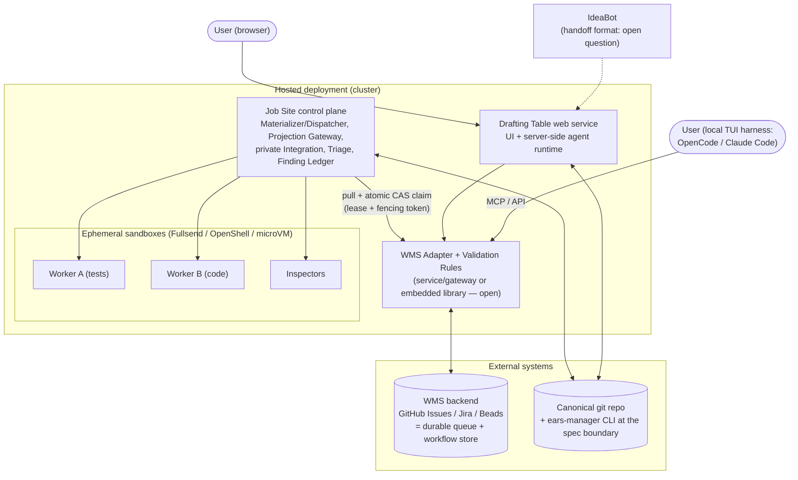

# ProtoBot — Most Likely Deployment Architecture

Derived from the design proposal in `docs/architecture/` (John Strunk's
documents, with the LUKAS margin notes). This is a reading of what the
proposal implies about *where things run*, not a decision record: the
proposal itself is not merged, and everything here inherits that status.

Citations are `file:line` into `docs/architecture/components.md` and
`docs/architecture/user-interaction-flow.md` as they stand today.

---

## Where Sketching and Dimensioning run

Sketching and Dimensioning are **not separate services**. They are two
phases of one interactive session hosted by a single component, the
**Drafting Table**, which consists of "a **frontend** (what the user
sees and interacts with) and an **agent harness** (what runs the model,
executes tools, manages the conversation)" (components.md:125–129). The
proposal deliberately allows two interchangeable implementations — a
Web Drafting Table ("A web application similar to IdeaBot… the harness
is a hosted agent runtime running server-side", components.md:133–142)
and a TUI Drafting Table (an existing coding agent such as OpenCode or
Claude Code on the user's local machine, connecting to the WMS "via MCP
or API", components.md:144–147; OpenCode is named as the first harness,
components.md:1741).

**Owner's direction (2026-09-03) revises the second option.** The two
implementations are the same React application, differing in how it is
delivered and where its agents run:

- **Web application** — the **default and preferred** version. The
  React frontend is served by a web server; the agent runs server-side,
  in the cloud. It is *not* just a SPA calling nothing — the persistent
  browser connection is what enables push notifications for blocked
  work. The user only has a browser; nothing is installed.
- **Electron application** — the same React application, installed on
  the user's local machine. The local install is what lets it trigger
  **local** agents, where the web version triggers agents in the cloud —
  that local-vs-cloud agent split is the differentiation point between
  the two.

Both can be used simultaneously on the same project
(components.md:527–531). What is shared and portable is the
**Specification Toolkit** — skills, prompts, and tool definitions. It
"is not a running service — it is a shared asset consumed by the agent
harness" (components.md:217–220).

**Is it a Temporal-style workflow engine with a UI on top?** No. There
is no workflow engine in the design. The durable "workflow" state is
the **build work item stored in the WMS backend** (GitHub Issues, Jira,
Beads…), with a state machine (`waiting → ready-for-building →
building → inspecting → merging → completed`, components.md:633–661)
enforced at the WMS Adapter's write boundary. The issue tracker *is*
the workflow store.

**IdeaBot handoff:** unresolved. The Drafting Table "receives IdeaBot
output as input to Sketching (handoff format is an open question)"
(components.md:186–188). Upload vs. API handover is not decided.

## Where the Job Site runs, and how it gets work

Server-side (with the single-player caveat below). The Job Site is one
engine covering **both** Building and Inspecting — they are phases of a
single claimed work item, not two services. Internally it splits into a
**trusted control plane** (Materializer/Dispatcher, Projection Gateway,
private Integration, Triage/Sanitizer, Finding Ledger) and an
**execution backend of isolated sandboxes** (Worker A, Worker B,
Inspectors) — the diagram at components.md:1143–1188 shows exactly this
split.

**There is no queue or message broker.** The design is explicitly
pull-based: the Job Site "dispatches them by pulling ready items from
the WMS when execution capacity is available" (components.md:110–114),
and "There is no external push scheduler" (components.md:1208). The
WMS backend itself is the durable queue: items sit in
`ready-for-building`, and a claim is an **atomic compare-and-swap**
that writes owner identity, a renewable lease, and a fencing token
(components.md:596–602). "How does it decide there's a free slot" is
left to the Job Site itself — it applies "business priority first, then
dependencies, aging, WIP limits, resource/backend fit, risk, and likely
path conflicts" (user-interaction-flow.md:886–891). The one broker-ish
piece is a **transactional outbox** on the WMS for atomically pairing
finding events with sanitized Worker tasks (components.md:622–627,
1356–1361) — the outbox pattern, not Kafka.

**Sandboxes/pods:** the first execution backend is **Fullsend**
(OpenShell-based), with direct OpenShell as fallback and a portable
profile of rootless Podman/OCI containers locally and "Kata, KubeVirt,
or another microVM boundary when hosted" (components.md:1704–1716).
Worker projections are "local temporary directories in single-player
mode and ephemeral sandbox volumes in hosted mode"
(components.md:961–963).

**The caveat:** single-player mode is a first-class deployment. The
whole thing can run on one machine — direct push plus a local
`register-approved-change-set` hook; "The difference is ceremony, not
architecture" (components.md:1682–1689). Conversely, "one ProtoBot
deployment may host many projects and adapter configurations"
(components.md:530–531), so hosted multi-tenant is also intended.

## Admin UI

**There isn't one in the design, and that's a real gap.** Observability
is delegated twice: the Drafting Table "Display[s] work item status
from the WMS" (components.md:169–170), and the WMS backend's own UI (a
GitHub project board, a Jira board) shows the queue for free. But
nothing in the documents covers operator concerns — see what is
executing where, kill a runaway sandbox, drain the Job Site. The
closest thing is the `abandoned` state, which is a data transition, not
a control surface. If a stop button is wanted, that is a comment to
raise on the proposal.

## Process inventory

| Piece | Runs as |
|---|---|
| Drafting Table (Sketching + Dimensioning + blocked-work UX) | One hosted web service (UI + server-side agent runtime), *or* a local TUI — or both at once |
| Job Site control plane | One long-running service (cluster in hosted mode, a process in single-player) |
| Workers / Inspectors | Ephemeral sandboxes (Fullsend/OpenShell, or Podman/microVM) spawned per work item |
| WMS Adapter + Validation Rules | The one genuine open choice: "inside the adapter service or as a mandatory validation gateway in front of thin backend translators" (components.md:1084–1086) — i.e., a shared service/gateway, or a library both callers embed |
| `ears-manager` | Not a service at all — a statically linked Go CLI binary (components.md:478–482) |
| Specification Toolkit, Validation Rules, Kits | Assets/libraries, "not a running service" (components.md:107, 219) |

So the honest answer to "how many backends": **two running services
minimum** (Drafting Table web runtime, Job Site control plane), plus
possibly a third if the WMS validation boundary becomes a gateway
service — everything else is CLIs, libraries, ephemeral sandboxes, and
external systems (git hosting, the issue tracker). Coordination is
pull + CAS against the WMS, not push and not a broker.

## Deployment diagram (hosted, multi-player)

In single-player mode the same boxes collapse onto one machine: the TUI
is the Drafting Table, the Job Site control plane is a local process,
sandboxes are local containers, and `register-approved-change-set` runs
as a local hook.

## Gaps this reading surfaces

1. **IdeaBot handoff format** — open in the proposal
   (components.md:186–188). Upload vs. API handover is undecided.
2. **No admin/ops surface** — no way in the design to observe or stop
   running execution beyond the WMS's own board and the `abandoned`
   data transition.
3. **Adapter vs. gateway** — whether Validation Rules enforcement lives
   inside the adapter service or as a gateway in front of thin
   translators (components.md:1084–1086). This is the decision that
   determines whether there are two or three running services.
