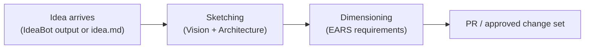
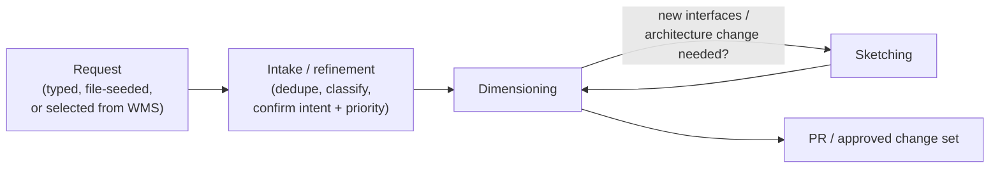

# Drafting Table — Agreed Architecture

Companion to [`architecture-design.md`](architecture-design.md). That
document reads the whole proposal for deployment shape; this one pins
down the Drafting Table specifically, recording the owner's decisions
of 2026-09-03 on top of John Strunk's proposal in `docs/architecture/`
and the analysis in `lukas-feedback.md` (item 10, "Refinement has no
shape").

Citations are `file:line` into `docs/architecture/components.md` and
`docs/architecture/user-interaction-flow.md` as they stand today.

---

## The two modes — one React application

The proposal defines the Drafting Table as "a **frontend** (what the
user sees and interacts with) and an **agent harness** (what runs the
model, executes tools, manages the conversation)"
(components.md:125–129), and offers a Web implementation and a TUI
implementation. **The owner's direction revises the pair**: both
implementations are the **same React application**, differing in how it
is delivered and where its agents run.

- **Web application — the default and preferred mode.** The React
  frontend is served by a web server; the agent harness runs
  server-side, in the cloud. Nothing is installed — the user only has a
  browser, and the persistent browser connection is what enables push
  notifications for blocked work. This is the hosted, multi-tenant
  deployment.
- **Electron application — the local, single-player mode.** The same
  React application, installed on the user's machine. The local install
  is what lets it trigger **local** agents, where the web version
  triggers agents in the cloud — that local-vs-cloud agent split is the
  differentiation point between the two.

**Both modes are designed for from the beginning.** The architecture
must run locally (Electron, local agents, no cluster) and deploy to the
cloud/cluster (web, hosted agents) without changing shape — the same
components, the same Specification Toolkit, the same WMS contract. This
keeps the proposal's own portability promise: "The difference is
ceremony, not architecture" (components.md:1689). The known blocker for
the local story is that no supported WMS backend currently runs on a
laptop (lukas-feedback.md, item 1); whatever answers that answers it
for the Electron mode.

## Tenancy and projects

**Multi-tenancy from the start — owner's decision.** Without it, every
user who logs into ProtoBot sees the same projects, which is not what
we want. Users are assigned to tenants (companies, teams, groups) and
see only the projects that belong to their tenant.

**Multi-project per tenant.** Already a design commitment: "one
ProtoBot deployment may host many projects and adapter configurations"
(components.md:527–531). Each project remains its own hard isolation
seam — its own git repo, its own WMS backend and adapter config.

How tenancy is built, so it stays cheap and correct:

1. **Enforcement is server-side at the Gate, never in the UI.** The
   Gate already maps the trusted subject to an authorization context —
   "project, role, work item/change set, allowed refs, actions … 
   Caller-supplied project or branch claims are not trusted"
   (components.md:1790–1800). Tenancy extends that context: a tenant
   field on the project record, a membership model binding users to
   tenants, and "user sees only their tenant's projects" as an
   authorization-context filter.
2. **No cross-project or cross-tenant global state** in the Drafting
   Table runtime — no shared caches keyed by anything but project.
3. **The session/conversation store is tenant- and project-scoped from
   the first line of code.** The proposal never says where the web
   Drafting Table's conversation state lives (the session-continuity
   open question, components.md:205–211); that store is the one place a
   tenancy mistake could take root.

Deferred until someone asks: tenant self-signup, per-tenant
branding/config, tenant admin consoles, billing. They bolt cleanly onto
a tenant-scoped system; the reverse retrofit is the disaster case.

In the Electron single-player mode there is one implicit tenant and the
tenancy machinery is dormant — same code, no hosted identity provider.

## The process: Intake (refinement), Sketching, Dimensioning

The proposal describes Sketching and Dimensioning but leaves refinement
as prose — an ownership sentence ("The Drafting Table agent and a human
project maintainer own backlog refinement",
user-interaction-flow.md:852–853) with no phase, no diagram, no exit
criteria. The agreed model adds it as an **Intake step, not a fifth
phase**: it crosses no human review boundary and produces no approved
artifact — its output is a confirmed classification, not a spec.

Requests get their own state machine, enforced in plain code at the WMS
write boundary like the build work item's
(components.md:1082–1096):

```text
new → triaging → classified → ready-for-dimensioning
                     ├→ duplicate   (terminal)
                     └→ rejected    (terminal)
```

**No workflow engine.** The WMS backend remains the durable state
store; transitions are explicit state machines plus plain routing code.
The scenario branching below lives *outside* the state machines — it is
just which state a record is born into.

### The two scenarios — discriminated by project state, not gesture

**Upload-vs-select is not the switch; project state is.** Uploading a
`feature.md` against an existing prototype must become a request and
enter refinement, not restart Sketching. The upload gesture and the
select gesture both exist in the UI; once a project exists they both
land in Intake.

**Scenario 1 — greenfield (no approved Sketch yet).** Happens once per
project: Vision and Architecture are "typically set once at project
start" (user-interaction-flow.md:93–95).



**Scenario 2 — existing prototype.** Everything — uploaded file, typed
request, IdeaBot follow-up, selected WMS request — enters as a request
and goes through refinement first. The Sketching detour is already
drawn in the proposal's Incremental Development diagram
(user-interaction-flow.md:960–962).



Dimensioning decides whether the architecture or interfaces must change
— if so it hops to Sketching and comes back — then opens the change
set/PR and the pipeline continues into Building and Inspecting.

## UI shape

The web Drafting Table stops being "a chat that starts at Sketching"
and becomes **tenant- then project-scoped**:

- Sign in → tenant membership resolves → the user sees only their
  tenant's projects.
- Inside a project, the home view is the **request backlog**: list and
  filter requests by refinement state, owner, and priority; open one;
  create one — typed or seeded from an uploaded file.
- Sketching appears only twice: as the **new-project wizard**
  (Scenario 1) and as the **detour from Dimensioning** (Scenario 2).
- The blocked-work surface and WMS status display stay as the proposal
  has them (components.md:160–171).

The Electron mode mirrors this with the implicit tenant, and pulls on
session start (the proposal's TUI pull model, components.md:152–155)
listing open requests, not only blocked work items.

## Backend structure

- **Web mode**: a web server serving the React frontend plus the
  server-side agent runtime (one hosted service), talking to the WMS
  Adapter over API/MCP, with the Gate enforcing the tenant- and
  project-scoped authorization context and a tenant/project-scoped
  session store.
- **Electron mode**: the same React frontend in the Electron shell, a
  local agent harness triggering local agents, the same WMS Adapter
  contract against a locally runnable backend (the open item above).

Changes this implies to the component spec, mapped onto the proposal:

1. **Responsibilities** (components.md:160–171) gain the backlog
   surface: list/filter/open/create requests and host the refinement
   session. Today the list knows only Sketching, Dimensioning,
   blocked-work resolution, and status display.
2. **Interfaces** (components.md:174–177): the WMS Adapter bullet gains
   the Requests API surface (components.md:585–590) — it exists in the
   adapter but has no consumer spec'd.
3. **Specification Toolkit** (components.md:224–239) gains a third
   skill beside Sketching and Dimensioning: how to conduct Intake —
   dedupe, classify, diff-preview. Toolkit logic, not web-app logic, so
   refinement stays portable across both modes.
4. **`ears-manager`** needs a bare-request comparison path — `compare`
   today requires a proposed change set (components.md:380), which
   under this model Dimensioning opens *after* refinement
   (lukas-feedback.md item 10, decision 3).
5. **Docs**: an Intake subsection shaped like Phases 1 and 2 (diagram,
   exit criteria, artifact), the request state machine, and the two
   scenario charts above — insertion points are in lukas-feedback.md
   item 10's "Where it goes" table.

## Open questions

1. **A locally runnable WMS backend** — the blocker for the
   Electron/single-player mode (lukas-feedback.md, item 1).
2. **IdeaBot handoff format** — open in the proposal
   (components.md:186–188); it feeds Scenario 1's intake.
3. **Where the conversation/session state lives** — the
   session-continuity open question (components.md:205–211); must be
   answered tenant- and project-scoped from the start.
