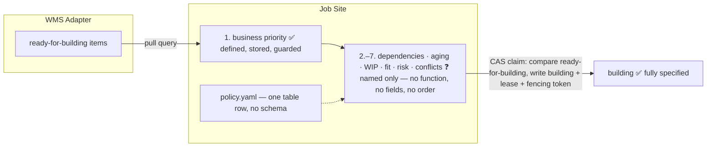

# Lack of Work Item Prioritization

An analysis of how the Job Site prioritizes work items, based exclusively on
the five documents in `docs/architecture/` (John Strunk's design proposal,
branch `initial-design`). Part 1 lists every property the documents involve in
prioritization and states, for each one, where it is defined, when it is
written, and where it is stored. Part 2 shows what the design actually
specifies today and proposes how to close the gaps.

The two source passages, quoted in full because they are the *entire*
specification of prioritization:

> **Dispatch:** Query the WMS Adapter for work items in `ready-for-building`
> state and pull them when the Job Site has capacity. The Job Site decides
> what to work on and when using reviewed project scheduling policy. Human
> business priority is authoritative; the Job Site applies dependencies,
> aging, WIP, resource/risk fit, and conflict avoidance without changing it.
> There is no external push scheduler.
> — `docs/architecture/components.md:1203-1208` (§ Job Site → Responsibilities)

> The Job Site owns **scheduling**, not product priority. Among ready work
> items it applies project policy using business priority first, then
> dependencies, aging, WIP limits, resource/backend fit, risk, and likely
> path conflicts. It records the factors behind each dispatch decision and
> cannot silently raise or lower business priority.
> — `docs/architecture/user-interaction-flow.md:886-890`

---

## Part 1 — The properties involved in prioritization

### Before any property applies: the eligibility gate

Priority is only ever evaluated over the set of work items already in
`ready-for-building`. Reaching that state is a hard gate, unrelated to
importance (`components.md:665-666`, `781-788`): the contract must be
complete, all impact candidates dispositioned, all dependencies resolved, and
the pre-claim refresh policy must have passed. An urgent item with an
unresolved dependency sits in `waiting` and is invisible to dispatch.

### Summary table

| # | Property | Defined in the docs? | When it is written | Where it is stored |
|---|:--|:--|:--|:--|
| 1 | Business priority | **Yes** — the only fully specified property | On the request, by a human; copied at change-set approval and at materialization | Request → change set → build work item (WMS Adapter) |
| 2 | Dependencies | **Yes** | At materialization | Build work item contract (WMS Adapter) |
| 3 | Aging | **No** — the word appears twice, never defined | Never written | Nowhere — no timestamp field is named in any contract |
| 4 | WIP limits / capacity | **Partially** — a policy home is named, no schema | With reviewed project policy (a human commit) | `.protobot/policy.yaml` (limit); current WIP only derivable from state/owner queries |
| 5 | Resource/backend fit | **No** — half exists (what a Job Site offers), half does not (what an item needs) | Sandbox profile: with reviewed policy. Item-side requirement: never | `.protobot/policy.yaml` (Job Site side); nowhere (work-item side) |
| 6 | Risk | **No** — named twice, never defined | Never written | Nowhere |
| 7 | Likely path conflicts | **No** — raw material exists, no mapping defined | Never written | Nowhere |
| 8 | The scheduling policy itself | **No** — one table-row mention, no schema | With reviewed project policy | `.protobot/policy.yaml` |

### 1. Business priority — the primary key, fully specified

The one property the design treats with rigor.

- **Defined:** `components.md:550-552` names it in the request backlog
  metadata ("human-owned business priority"); `user-interaction-flow.md:880-884`
  gives it semantics: "Interfaces and requirements do not carry delivery
  priority: once approved, every active requirement is binding. The request's
  human-owned business priority represents the desired change across all
  affected interfaces."
- **When written:** On the **request**, by a human, during
  Sketching/Dimensioning. Then *copied* — "is copied to its change set and
  build work item" (`user-interaction-flow.md:883`). Updates afterwards are
  restricted: the Adapter API allows "update business priority only for an
  authorized human maintainer" (`components.md:587-588`), and every change
  carries an audit event (`user-interaction-flow.md:884`).
- **Where stored:** Three places, by copy-down: the **request** (WMS Adapter
  backlog metadata), the **change set**, and the **build work item**. It is
  queryable — requests can be queried "by refinement state, owner, priority,
  or typed relationship" (`components.md:588-589`).
- **What is still missing even here:** No scale. No enum, no range, no
  ordering rule for the value itself — only that a maintainer owns it.

### 2. Dependencies — specified, but as a gate, not a rank

- **Defined:** Part of the durable work-item contract: materialization
  "writes its source specification and code commits, … impact dispositions,
  **dependencies**, and provenance as one durable contract"
  (`components.md:591-595`; also `781-783`).
- **When written:** At **materialization**, by the Job Site Materializer,
  from the approved change-set manifest.
- **Where stored:** On the **build work item** in the WMS Adapter. Queryable
  ("by ID, state, **dependency**, owner, or idempotency key",
  `components.md:603`); the Beads backend even stores them natively as
  "dependency links" (`components.md:542`).
- **The catch:** By the time dispatch runs, dependencies have already done
  their work — an item with unresolved dependencies is in `waiting`, not
  `ready-for-building` (`components.md:663-666`). What "then dependencies"
  means *inside* the ready set (prefer items that unblock many others?
  topological closeness?) is not stated.

### 3. Aging — a word, not a property

- **Defined:** Nowhere. The word appears exactly twice in the whole design —
  `components.md:1207` and `user-interaction-flow.md:888` — both times as an
  item in a list.
- **When written:** Never. No clock is named: not time since request
  creation, not since materialization, not since entering
  `ready-for-building`.
- **Where stored:** Nowhere. The work-item contract enumeration
  (`components.md:591-595`) carries no timestamp field, and the query
  surface (`components.md:603-604`) cannot select by age.
- **The structural problem:** Aging exists to prevent starvation, which
  means it must eventually *outrank* a higher business priority. But the
  normative rule is "business priority first" and the Job Site "cannot
  silently raise or lower business priority"
  (`user-interaction-flow.md:887-890`). As written, aging can never change
  an outcome — it is inert.

### 4. WIP limits and capacity — a home without a schema

- **Defined:** Only by naming its storage location: `.protobot/policy.yaml`
  holds "Required Inspectors, **WIP/scheduling policy**, sandbox profile,
  and other reviewed project policy" (`components.md:737`). Dispatch pulls
  "when the Job Site has capacity" (`components.md:1204`) — capacity itself
  is undefined.
- **When written:** As reviewed project policy — a human commit to the repo,
  like every other `.protobot/` file.
- **Where stored:** The *limit* in `.protobot/policy.yaml`. The *current*
  WIP is not stored anywhere as such; it is only derivable by querying the
  adapter for items in `building` owned by this Job Site
  (`components.md:603`).
- **Missing:** Any key names, any example, any statement of scope (per Job
  Site? per project? per backend?). Every sibling file in the control
  namespace gets elaborated somewhere in the document — `projection.yaml`
  (deny-by-default path classification), `test-catalog.jsonl` (stable test
  IDs, requirement links, verification modes) — `policy.yaml` never is.

### 5. Resource/backend fit — one side of a comparison

- **Defined:** Named as "resource/risk fit" (`components.md:1207`) and
  "resource/backend fit" (`user-interaction-flow.md:888`) — note the two
  lists do not even agree on the property's name.
- **When written / where stored:** The **Job Site side** half-exists: the
  sandbox profile lives in `.protobot/policy.yaml` (`components.md:737`),
  written as reviewed policy. The **work-item side** — what an item
  *requires* to be built — does not exist: no field in the contract
  (`components.md:591-595`), no producer, nothing to compare the sandbox
  profile against.

### 6. Risk — undefined, unsourced, unstored

- **Defined:** Nowhere, in a scheduling sense. Only the same two list
  entries. Every other occurrence of "risk" in the tree is a different
  concept: the prohibition of an `accepted-risk` bypass in
  Inspector/mutation disposition (`components.md:1428`,
  `user-interaction-flow.md:609`, `open-questions.md:84`), and the external
  AI Agent Risk framework rating ProtoBot itself as a tool
  (`components.md:1817`, `open-questions.md:165`, `related-work.md:303`).
  Neither is a per-work-item property.
- **When written:** Never. No producer is named — nothing in
  materialization, impact analysis, or refinement emits a risk value.
- **Where stored:** Nowhere. Not in the request metadata
  (`components.md:550-552`), not in the work-item contract
  (`components.md:591-595`), not queryable (`components.md:603-604`). There
  is no scale, and no evidence trail — nothing to audit a dispatch decision
  against, even though `user-interaction-flow.md:889` demands the factors be
  recorded.

### 7. Likely path conflicts — raw material without a computation

- **Defined:** Named as "conflict avoidance" (`components.md:1207`) and
  "likely path conflicts" (`user-interaction-flow.md:888`). Nothing more.
- **When written / where stored:** Never, nowhere — as a property. The raw
  material arguably exists: the contract carries changed and applicable
  requirement IDs (`components.md:593-594`), `.protobot/projection.yaml`
  classifies paths (`components.md:736`), and every item gets its own
  branch (`components.md:724-726`). But no mapping from requirements to
  likely-touched paths is stored on any item, and no overlap computation is
  described.

### 8. The scheduling policy itself

The function that would combine properties 1–7 is delegated wholesale to
"reviewed project scheduling policy" (`components.md:1205-1206`), whose only
appearance is the single table row at `components.md:737`. No schema, no
example, no key names, no default. And the gap is unregistered: none of this
appears in `docs/architecture/open-questions.md` — the Building-phase entries
are #8, #9, #10, #15, #19, #20 (merge infrastructure, test categories,
mutation operators, triage, applicability metadata, conformance views).
Scheduling is absent, so the confident prose reads as a decided design when
six of its seven inputs are undefined words in a list.

- - -

## What's Now?

The design fixes **who decides** (the Job Site, pulling), **what is
authoritative** (human business priority, first and untouchable), and **where
the policy lives** (`.protobot/policy.yaml`). Everything else is a list of
words.



What is specified versus not, side by side:

| Layer | Status |
|:--|:--|
| Eligibility (`ready-for-building` gate) | ✅ Fully specified — contract complete, dispositions done, dependencies resolved, pre-claim refresh passed |
| Primary key (business priority) | ✅ Specified — human-owned, copied request → change set → work item, audit on change. ❌ No scale |
| Secondary ordering (six factors) | ❌ Two prose sentences; the two lists differ in wording and order; no combination rule (lexicographic? weighted?) |
| Aging | ❌ Inert as written — cannot outrank business priority, so it cannot prevent starvation |
| Risk, fit, path conflicts | ❌ No definition, no producer, no storage, no query |
| Policy schema | ❌ `.protobot/policy.yaml` mentioned once, never elaborated |
| Dispatch decision record | ❌ Obligation stated (`user-interaction-flow.md:889`) but the Adapter API (`components.md:585-627`) has no operation to store it |
| Claim correctness (CAS + fencing token) | ✅ Fully specified — which shows the document *can* be precise when it decides to be |

The asymmetry in the last row is the tell: the design invests heavily in
making the *claim* safe (atomic compare-and-swap, leases, fencing tokens,
per-backend capability table) while leaving the *choice* of what to claim
almost entirely open — and does not list that openness in
`open-questions.md`.

- - -

## How It Could Be

Proposals to close each gap, smallest change first. All of them keep the two
rules the design already makes normative: business priority stays
human-owned, and the Job Site never silently changes it.

### 1. Define the combination rule: filters, then a score

Make the six factors explicit as two different kinds of thing, because they
are:

- **Hard filters** (an item is claimable or it is not):
  - *WIP limit* — if this Job Site is at its `building` cap, claim nothing.
  - *Resource/backend fit* — skip items whose `requires` (see § 3) the Job
    Site's sandbox profile cannot satisfy.
  - *Path conflict* — skip items whose predicted path set overlaps an item
    this Job Site (or, if visible, any Job Site) currently has in `building`.
- **A scoring function** over what survives:

  ```text
  effective_priority = business_priority + aging_boost(ready_since)
  score = (effective_priority, unblocks_count, -risk_penalty)   # lexicographic
  ```

  `aging_boost` is a step function: after `N` days in `ready-for-building`,
  the item's *effective* priority for scheduling rises one level per
  configured period, capped at the maximum. This resolves the aging paradox
  without violating the guard: the stored business priority is never
  mutated — no audit event, no silent change — only the Job Site's local,
  recorded scheduling view of it rises. `unblocks_count` (how many `waiting`
  items depend on this one) gives "then dependencies" a concrete meaning
  inside the ready set.

### 2. Give aging a clock

Define it as **time since the item last entered `ready-for-building`**, for
two reasons grounded in the existing lifecycle: it resets naturally when an
item cycles back (lease expiry, `merging → ready`, blocked-and-resolved —
`components.md:647-652`), and it measures the thing starvation actually is —
time spent claimable but never claimed. Storage: a `ready_since` timestamp
written by the adapter on every transition *into* `ready-for-building`, added
to the lifecycle-transition operation (`components.md:596-602`).

### 3. Make risk and fit real fields with a named producer

The materializer already reruns deterministic impact analysis and constructs
the complete versioned contract (`components.md:1197-1202`). Let it also
emit, into the same contract:

- **`risk`** — a small enum (`low | medium | high`), derived from facts it
  already computes: change type (revision of an existing requirement >
  addition), count of applicable requirement IDs, and the spread of
  predicted paths across `projection.yaml` classes. Because the producer is
  deterministic and the value lands in the durable contract, the evidence
  question answers itself: the risk value is auditable back to the
  materialization inputs, and re-materialization refreshes it.
- **`requires`** — the item-side half of resource/backend fit: language
  toolchains, sandbox capabilities, external services needed. Compared at
  dispatch against the sandbox profile already in `.protobot/policy.yaml`.
- **`predicted_paths`** — the requirement-to-path estimate from impact
  analysis, enabling the conflict filter in § 1. Advisory only; the merge
  machinery already handles real conflicts (`components.md:649`), so a wrong
  prediction costs a rebuild, not correctness.

All three become part of the enumerated contract at `components.md:591-595`
and queryable at `components.md:603-604`.

### 4. Give `.protobot/policy.yaml` the elaboration its siblings have

A concrete schema for the scheduling block, matching the reviewed-policy
model (humans commit it, the Job Site only reads it):

```yaml
scheduling:
  priority_scale: [p0, p1, p2, p3]   # closes the "no scale" gap too
  wip_limit: 2                       # per Job Site, items in `building`
  aging:
    boost_after_days: 5              # +1 effective level per period
    max_boost_levels: 2
  risk:
    high_requires_free_capacity: 2   # don't take high-risk at the WIP edge
  conflict_avoidance: local          # local | global | off
```

### 5. Give the dispatch decision record a home

`user-interaction-flow.md:889` obliges the Job Site to record "the factors
behind each dispatch decision", but no Adapter API operation can store one.
Add a **dispatch event** to the API surface (`components.md:585-627`),
shaped like the finding ledger: append-only, idempotency-keyed, carrying the
claimed item, the ready set size, each factor's value
(`business_priority`, `aging_boost`, `risk`, filters applied), and the
resulting score. That makes "cannot silently raise or lower business
priority" *checkable* instead of aspirational — an auditor can recompute the
decision from the recorded inputs.

### 6. Register the gap

Until the above (or any alternative) is accepted, add one entry to
`docs/architecture/open-questions.md` under the Building phase: *"How do the
six secondary scheduling factors combine, where are risk / fit / conflict
data produced and stored, and what is the schema of the scheduling policy in
`.protobot/policy.yaml`?"* Either the ordering function belongs in the text
next to `policy.yaml`, or it belongs in `open-questions.md` as an
acknowledged gap — what it cannot be is absent from both.
