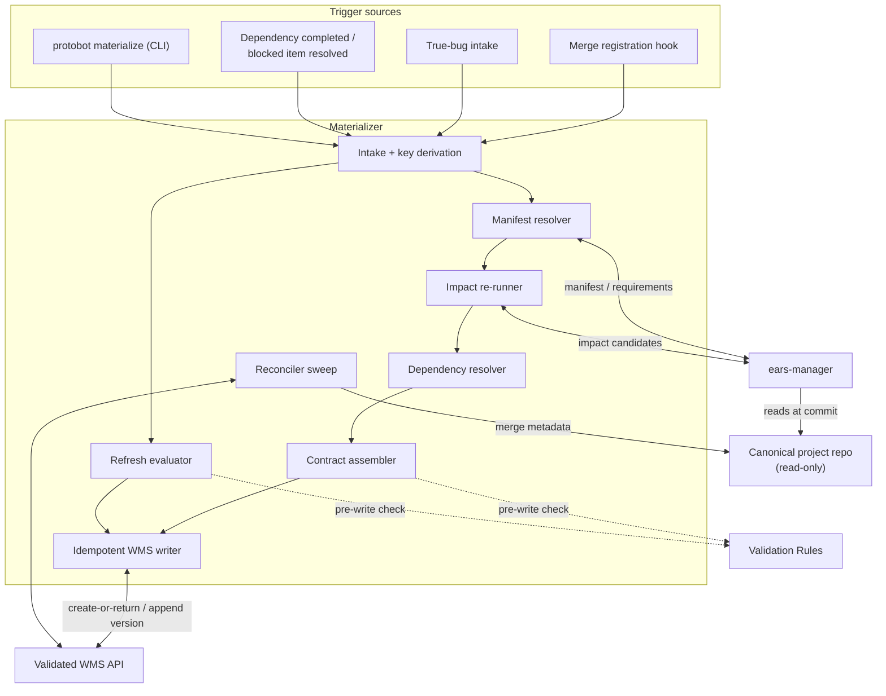

# Materializer

> **Status: proposal.** The architecture documents in
> [`../architecture/`](../architecture/) reference a "materializer" and a
> "Materialize / Dispatch" control-plane box in nine places but never
> define it. This document collects those references, answers *what kind
> of thing it is*, and proposes a design. It is a separate document by
> design — nothing in `../architecture/` is edited by it.

---

## Contents

- [What the existing documents already say](#what-the-existing-documents-already-say)
- [What kind of thing is it?](#what-kind-of-thing-is-it)
- [Why it is separate from the Job Site](#why-it-is-separate-from-the-job-site)
- [Triggers](#triggers)
- [Responsibilities](#responsibilities)
- [The resulting state is determined, not chosen](#the-resulting-state-is-determined-not-chosen)
- [What it must not do](#what-it-must-not-do)
- [Contract assembly](#contract-assembly)
- [Idempotency key](#idempotency-key)
- [Internal structure](#internal-structure)
- [Deployment shapes](#deployment-shapes)
- [Failure behaviour](#failure-behaviour)
- [Evaluability](#evaluability)
- [Interfaces](#interfaces)
- [Open design questions](#open-design-questions)
- [If this proposal is accepted](#if-this-proposal-is-accepted)

---

## What the existing documents already say

The component is never introduced, but its behaviour is specified
piecemeal across the three documents. Collected:

| Where | What it says |
|---|---|
| `components.md` § Job Site diagram | A control-plane box labelled `Materialize / Dispatch`, sitting between the canonical repo, `ears-manager`, and the validated WMS API |
| `components.md` § Job Site → Responsibilities | "Receive an approved-change-set registration or true-bug intake event. Resolve the exact manifest through `ears-manager`, rerun deterministic impact analysis, resolve dependencies, construct the complete versioned contract, and call the WMS Adapter's idempotent materialization operation. **This control-plane function runs independently of Worker capacity.**" |
| `components.md` § Job Site → Internal structure | A sub-component named `Materializer/Dispatcher`: "Converts approved change sets and bug reports into complete WMS contracts, reconciles Git/WMS operations, and atomically claims ready work for available execution slots." |
| `components.md` § multi-player sequence diagram | Drawn as its own participant, `MAT as Materializer` — *outside* the Job Site box, contradicting the diagram above |
| `components.md` § `ears-manager` change sets | "An approved change set materializes one build work item by default. The materializer reruns deterministic analysis at the resulting specification commit and creates the item in `blocked` if any candidate lacks a reviewed disposition." Plus the dependency-completion refresh, and the two commits that "form the materialization idempotency input" |
| `components.md` § WMS Adapter | "Persist materialized work idempotently: atomically create-or-return the complete contract already assembled by the Job Site Materializer" |
| `components.md` § Validation Rules | Named as a caller of the shared rules library, alongside the Drafting Table and Job Site |
| `components.md` § credential isolation | "Only the Materializer, Integration/Merge service, and WMS \[…\]" hold a mutation role |
| `user-interaction-flow.md` § true bugs | "The materializer conservatively includes \[every deterministic impact candidate in\] the affected applicability scope" |

Two things follow immediately. First, the responsibilities listed are
already **deterministic** — resolve, rerun, construct, call — with no
step that requires judgement. Second, the documents disagree with
themselves about where it lives: a box inside the Job Site control plane
in one diagram, a peer participant in another.

---

## What kind of thing is it?

| Question | Answer |
|---|---|
| Is it an agent? | **No.** Deterministic conventional code, like `ears-manager`. It makes no model call and exercises no judgement. Every disposition it acts on was reviewed by a human during Dimensioning; if one is missing it blocks rather than deciding. |
| Is it a service? | **Yes** in multi-player mode — a long-running, headless process receiving merge-registration events and running a periodic reconciliation sweep. |
| Is it a CLI? | **Also yes** — the same entrypoint invoked as `protobot materialize` by a local hook in single-player mode, and by an operator for recovery. The CLI and the service run the same code path; the difference is ceremony, not architecture. |
| Is it an API? | It exposes only event intake plus a status/dry-run query. It is a *client* of the WMS Adapter API and of `ears-manager`. It defines no new persistence API. |
| Is it a UI? | **Never.** Its outputs are read and displayed by the Drafting Table. |
| Is it stateful? | **No.** All durable state lives in Git and the WMS. It is restartable, replayable, and safe to run twice. |

The shape that satisfies all of the above is **a single stateless binary
with two front doors — an event listener and a CLI — over one
deterministic core.**

In one sentence: *the Materializer is the seam between the
human-approved specification world and the autonomous execution world.*
It takes an approved specification change — or a true-bug report, which
needs no specification change — and produces exactly one complete,
durable build work-item contract in the WMS. Nothing reaches the Job
Site that the Materializer did not construct and the WMS did not accept.

---

## Why it is separate from the Job Site

Materialization and dispatch are different concerns and this proposal
separates them:

- **Materialization is event-driven** and must run when there is no
  execution capacity at all. A project with a paused, saturated, or
  entirely absent Job Site must still accumulate a correct, queryable
  backlog — otherwise "what work is waiting?" has no answer until a
  Worker frees up.
- **Dispatch is capacity-driven** and runs only when a Worker slot is
  free. It is a scheduling decision over an existing queue.

`components.md` already states the first half of this ("runs
independently of Worker capacity") while drawing it inside the engine
whose capacity it is independent of. The two share a trust domain — both
hold WMS mutation credentials — but not a lifecycle.

Under this proposal the Job Site keeps a **Dispatcher** (query
`ready-for-building`, atomically claim one item for a free execution
slot under reviewed scheduling policy) and loses contract construction
entirely. It consumes contracts; it never builds one.

---

## Triggers

Exactly four intake events. The Materializer does not poll for work to
invent, and there is no external push scheduler.

| Trigger | Source | Produces |
|---|---|---|
| Approved change set registered | Merge hook on main (multi-player) or `register-approved-change-set` (single-player) | A new work item, or a recorded no-op when the manifest declares no implementation effect |
| True-bug intake | Bug report naming violated requirement IDs and affected scope | A new work item with an empty changed set |
| Dependency completed | WMS completion of a work item another item depends on | A pre-claim baseline refresh of the dependent item |
| Blocked item resolved | Approved impact amendment, added requirement, or out-of-scope declaration | A blocked-item resume refresh |

The last two are refreshes of an existing contract, not new
materializations. **Pre-merge revalidation is deliberately not here:** it
is performed by the Job Site that currently holds the lease, because it
must run under the same fencing token as the branch it is refreshing.

---

## Responsibilities

For a create trigger, in order:

1. **Derive the idempotency key** from the trigger before doing any
   other work, so a duplicate delivery converges on the same record.
2. **Resolve the manifest** at the approved specification commit through
   `ears-manager`. The repository is read-only to this component.
3. **Rerun deterministic impact analysis** (`ears-manager impact`) at
   that commit. Re-running rather than trusting the manifest is the
   point: the approved dispositions must still cover every candidate the
   analysis produces at the commit that actually landed.
4. **Resolve dependencies** — any incomplete work item that introduced
   or revised one of this item's applicable requirements.
5. **Assemble the complete contract** and evaluate it against the shared
   Validation Rules for early, structured diagnostics.
6. **Write it once** through the WMS Adapter's atomic create-or-return
   operation. Dispatch must never observe a partial item.

For a refresh trigger it evaluates every check in the decided
contract-refresh policy, then appends a new contract version and moves
the item to `ready-for-building`, or leaves it `blocked` for a reviewed
impact amendment, or supersedes it outright when a changed requirement
or incompatible intent makes refresh unsound.

Independently of both, a **reconciler** sweep repairs split Git/WMS
outcomes: it finds a merge by change-set and work-item metadata and
retries the same idempotent operation. It never creates duplicate work
and never repeats a completed merge.

---

## The resulting state is determined, not chosen

| Situation at the approved commit | Resulting state |
|---|---|
| Manifest declares no implementation work required | No item created; the decision and its rationale are recorded |
| Any impact candidate lacks a reviewed disposition | `blocked` |
| An incomplete work item introduced or revised an applicable requirement | `waiting`, with a recorded dependency |
| Everything dispositioned, no outstanding dependencies | `ready-for-building` |

For a true bug the Materializer conservatively marks **every**
deterministic impact candidate applicable. It cannot exclude a
candidate; narrowing requires an impact change set routed through
Dimensioning.

---

## What it must not do

These are the boundaries that make the human review gate meaningful, so
they are stated as prohibitions rather than left implicit:

- **No dispositions of its own.** A missing or ambiguous disposition
  blocks the item. It never resolves impact by inference.
- **No regrouping.** One approved change set materializes one build work
  item. Splitting or combining requires a separately reviewed delivery
  plan and a fresh impact assessment.
- **No specification writes.** `ears-manager` is the single write gate;
  the Materializer only reads through it.
- **No Git mutation.** It creates no branches and merges nothing. The
  Job Site creates the `wi/` branch after it claims the item.
- **No claiming or scheduling.** It never moves an item to `building`
  and never orders the ready queue.
- **No priority changes.** Business priority is human-owned; the
  Materializer copies it from the request onto the contract unchanged.

---

## Contract assembly

The contract the Materializer writes is **complete on first write**. It
carries the changed requirement operations (possibly empty), the
applicable requirements, the derived delivery obligations, the source
specification and code commits, the source change set or bug report,
dependencies, the stable materialization key, the initial contract
version and fencing token, change type, and provenance. The full field
list is in
[Work item lifecycle](../architecture/user-interaction-flow.md#work-item-lifecycle).

Two commits identify the change unambiguously: the manifest's immutable
**base** specification commit and the **resulting merge commit** recorded
by the WMS. The approved commit cannot be embedded in the manifest it
contains, so those two together are both the audit record and the
materialization idempotency input.

---

## Idempotency key

```text
change set:  (project, "change-set", change_set_id,
              base_spec_commit, resulting_merge_commit)
true bug:    (project, "bug", bug_report_id, source_spec_commit)
```

The key contains no wall-clock time, retry count, hostname, or delivery
sequence number. A webhook redelivery, a CLI invocation racing the
service, and a reconciler sweep therefore all converge on the same work
item. Restarting logical work that was abandoned is the one case that
mints a *new* key, and it must explicitly retarget any dependents.

---

## Internal structure



Every box is deterministic and side-effect-free except the writer and
the reconciler, which are the only components that mutate anything. That
split is what makes the whole path replayable.

---

## Deployment shapes

| Mode | How it runs | Notes |
|---|---|---|
| Single-player | CLI, invoked by a local post-merge hook or by hand | Direct push to main is not sufficient by itself — the registration step must still run |
| Multi-player, no cluster | Long-running local process behind a webhook tunnel, or a CI job on merge to main | The reconciliation sweep covers missed deliveries |
| Multi-player, hosted | Deployment separate from the Job Site, scaled independently | One deployment may serve many projects; per-project WMS adapter configuration |

Running the CLI while the service is live is safe by construction; the
idempotency key makes the second invocation a read.

---

## Failure behaviour

- **Crash between read and write** — no partial state exists, because
  contract assembly is in-memory and the write is one atomic
  create-or-return. Re-running reaches the same result.
- **Write succeeded, response lost** — the retry returns the existing
  item rather than creating a second one.
- **Git merged, WMS write failed** — the reconciler finds the merge by
  change-set metadata and retries the same operation.
- **Impact analysis disagrees with the approved manifest** — the item is
  created `blocked`. This is the intended outcome, not an error: the
  specification moved between review and merge, and a human must look.
- **`ears-manager` rejects the manifest** — nothing is written and the
  failure is reported against the merge commit. CI's `ears-manager
  check` gate should have caught it first.

---

## Evaluability

Materialization takes `(repository commit, WMS snapshot, trigger event)`
and returns a contract. Both inputs are content-addressed and the
function is deterministic, so a recorded trigger can be replayed against
a fixture repository with no live WMS and the output diffed against a
golden contract. This is the cheapest eval surface in the system and it
satisfies the day-one evaluability constraint without instrumentation
beyond recording the trigger.

The metric worth watching first is the fraction of materializations that
land `blocked` — a rising rate means Dimensioning's impact review is
drifting from what the deterministic analysis finds at merge.

---

## Interfaces

- **To `ears-manager`:** Read-only. Resolves the change-set manifest,
  requirements, and interfaces at an immutable commit and reruns
  `ears-manager impact`. Never writes.
- **To WMS Adapter:** Idempotent create-or-return materialization,
  append-only contract-version writes, dependency and blocked-item
  queries, and reconciliation lookups by idempotency key.
- **To Validation Rules:** Evaluates the proposed contract and each
  transition before writing, for early structured diagnostics. The WMS
  write boundary remains the authoritative enforcement point.
- **To project repo:** Read-only access at the recorded commits, plus
  merge metadata for reconciliation. No branch creation, no merges.
- **From trigger sources:** Merge registration hook, true-bug intake,
  WMS completion events, and the CLI.
- **To Drafting Table (indirectly):** Everything it writes is visible
  through the WMS Adapter — blocked items, dependencies, and the reason
  an item is not yet ready.

---

## Open design questions

- **Deployment boundary.** This document proposes a service deployed
  separately from the Job Site while sharing its trust domain. Is that
  right, or should it be a Job Site subprocess with a guarantee that it
  runs even when execution capacity is zero? The Fullsend backend's
  extension points may decide this.
- **Trigger reliability.** Is a webhook plus a periodic reconciliation
  sweep sufficient, or does registration need to be a merge-gating CI
  job so that "merged but never materialized" cannot happen at all? What
  is the acceptable delay between merge and a queryable work item?
- **Refresh ownership split.** Pre-claim refresh and blocked-item resume
  belong here; pre-merge revalidation belongs to the leaseholding Job
  Site. Three refresh contexts evaluating one shared policy in two
  components is a drift risk — should the policy be a shared library
  like Validation Rules, or should one component own all three?
- **Supersession policy.** When a refresh fails, when should the item be
  superseded rather than blocked, who retargets its dependents, and is
  that decision ever autonomous?
- **Packaging.** The Materializer shares `ears-manager`'s read path and
  determinism requirements. One static Go binary with both surfaces, or
  two artifacts? A single binary simplifies the sandbox and CI story;
  two keep `ears-manager` free of WMS dependencies.
- **Multi-project deployment.** One Materializer per project, or one
  serving many with per-project adapter configuration and credential
  scoping?

---

## If this proposal is accepted

The edits it implies in [`../architecture/`](../architecture/), listed
here rather than made:

- `components.md` — promote the Materializer to a top-level component
  (seven becomes eight) in the numbered list and the component diagram;
  relabel the Job Site control-plane node `Materialize / Dispatch` to
  `Dispatch / claim`; narrow the Job Site's **Materialization**
  responsibility and its `Materializer/Dispatcher` sub-component to
  dispatch only, cross-referencing this document; fix the sandbox
  section's "Materializer/Dispatcher creates WMS contracts and
  coordinates projection creation" to split the two subjects.
- `overview.md` — add a Terminology row for the Materializer, and name
  it in the § Single-player mode component list.
- `user-interaction-flow.md` — no change required; every reference there
  is to the verb, not the component.

## Related documents

- [Architecture overview](../architecture/overview.md)
- [Components](../architecture/components.md)
- [User interaction flow](../architecture/user-interaction-flow.md)
- [Open questions](../architecture/open-questions.md)
