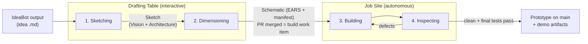

# Scenario 1 — New project from an idea

**Situation:** You discussed an idea with IdeaBot and have its output — a
markdown document describing the idea. Nothing else exists yet: no
specs, no code. This is the one situation where you pass through all
four phases in order.



The first two phases happen on **one git branch** with **one change
set**: Vision, Architecture, requirements, and the change-set manifest
are all written there, and one PR merge approves them together.

---

## Phase 1: Sketching

| | |
|---|---|
| **Triggered by** | You start a Drafting Table session with your idea |
| **Input** | The IdeaBot output / free-form description (handoff format is still an open question) |
| **Output** | The **Sketch** = Vision (what/who/why) + Architecture (external interfaces + their types, environmental constraints) |
| **Where it lives** | **Git**, on the change-set branch — prose files at paths configured in `.protobot/project.yaml`, written through `ears-manager`, never directly |

## Phase 2: Dimensioning

| | |
|---|---|
| **Triggered by** | Sketching is done — you and the agent continue on the same branch |
| **Input** | The Sketch + the open change set |
| **Output** | The **Schematic** = EARS requirements per interface (requirement store, tentatively JSONL) + the change-set manifest with the impact assessment |
| **Where it lives** | **Git** — same branch; you open a PR against `main`. On merge, the approved manifest sits in `.protobot/change-sets/` |

**The handoff to autonomy:** merging the PR is the human review
boundary. On merge, the materializer creates **one build work item** in
the **WMS backend** (an issue/ticket) with the approved requirement IDs
frozen at that spec commit. Nothing after this point involves you,
unless something gets blocked.

## Phase 3: Building

| | |
|---|---|
| **Triggered by** | The Job Site **pulls** — it claims a `ready-for-building` work item from the WMS when it has capacity. Nothing pushes work to it |
| **Input** | The work-item contract: changed + applicable requirement IDs, the source spec commit (plus the full Schematic for context) |
| **Output** | Working **code and tests** — Worker A writes tests, Worker B writes code, neither sees the other; loop until all tests pass |
| **Where it lives** | **Git**, on a new `wi/<id>-<slug>` branch. Work-item state (`building`) lives in the **WMS** |

## Phase 4: Inspecting

| | |
|---|---|
| **Triggered by** | Tests pass in Building — the work item moves to `inspecting` |
| **Input** | The candidate code + tests on the `wi/` branch |
| **Output** | Inspector **findings** (append-only ledger); when clean and the final test run passes: a sealed inspection snapshot + report + demo artifacts, and the branch **merges to main** |
| **Where it lives** | Findings: ledger behind the **WMS** boundary. Snapshot, report, demo manifest: **git**, `.protobot/attestations/` on the `wi/` branch → `main`. Work item marked `completed` in the **WMS** with the merge commit |

---

## What exists when it's done

```text
git main:
  .protobot/
    project.yaml            where the spec artifacts are
    change-sets/CS-001…     the approved change-set manifest
    attestations/           inspection report, demo manifest
  <vision / architecture>   paths you configured (e.g. docs/vision.md)
  <requirement store>       EARS requirements (tentatively JSONL)
  src/…  tests/…            generated code and tests

WMS backend:
  WI-001  state: completed  (records the merge commit)
```

Next: [Scenario 2 — a new request on this prototype](02-add-feature.md).
