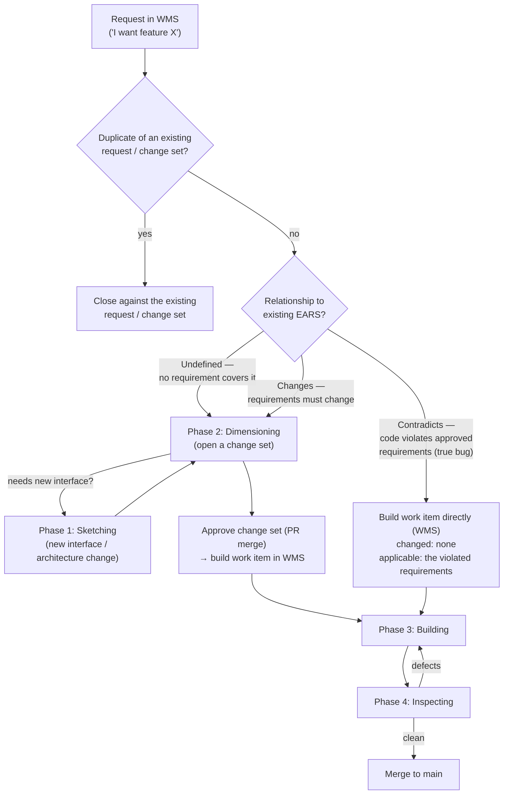

# Scenario 2 — A new request on an existing prototype

**Situation:** Scenario 1 is done. The prototype and its approved specs
are on `main`, and there is history:

```text
git main:     approved specs + code, .protobot/change-sets/ (approved manifests)
git branches: some proposed change sets still under review (open PRs)
WMS:          open requests (the backlog), build work items in various states
```

Now you want something new — a feature, a different behavior, or a fix.

## Where does my feature request live?

Not in git, and not in a markdown file. You record it as a **request**
in the **WMS backend** (a Jira/GitHub/GitLab issue, a Trello card…). It
captures the intent ("I want it to do X"), the rationale, and your
business priority. Specification content only enters git later, when
Dimensioning turns the request into a change set.

## Who decides which phase it triggers?

**You never name a phase yourself** — but you do decide the input that
picks it. It works like this:

1. **Refinement first.** The Drafting Table agent and you (the human
   maintainer) refine the request: first rule out that it is a
   **duplicate** of an existing request or change set, then classify it
   by its relationship to the existing EARS requirements — **undefined**,
   **changes**, or **contradicts**. You also identify the affected
   interfaces. **You confirm the classification** — and the
   classification is what sets the entry point.
2. **The change type sets the entry point** (this is a Validation Rules
   concern): a normal feature request (undefined or changes) enters at
   **Dimensioning**. Only a true bug (contradicts) skips the interactive
   phases entirely.
3. **Dimensioning pulls in Sketching when needed.** You are right that a
   feature can change the architecture. You still don't call Sketching
   yourself: during Dimensioning, if the change needs a new interface or
   an architecture change, it routes through Sketching first (define the
   interface, update the Architecture), then comes back to Dimensioning
   to write the requirements.



## The three change types

### Case A — Undefined

No existing requirement covers the behavior. Example: adding a "forgot
password" flow to an auth API that never mentioned it.

- **Path:** request → Dimensioning (→ Sketching first if it needs a new
  interface) → approved change set → build work item → Building →
  Inspecting.
- **Output of Dimensioning:** a change set that **adds** new
  requirements. Git: branch + PR; manifest in `.protobot/change-sets/`
  on merge. The work item lives in the WMS; its code on a `wi/` branch.

### Case B — Changes

A requirement exists, but you want different behavior. The code may be
perfectly correct *per the current spec* — the spec itself is what
changes. Example: "cache TTL should be 10 minutes, not 5."

- **Path:** same as Case A — request → Dimensioning → change set → work
  item → Building → Inspecting.
- **Output of Dimensioning:** a change set that **revises** (or retires)
  existing requirements. Requirements keep their stable IDs across
  revisions; the change set records the before/after delta. Same storage
  as Case A.

### Case C — Contradicts (a true bug)

An approved requirement exists and the implementation violates it.
Example: the spec says "shall return 401 for expired tokens" but the
system returns 200.

- **Key difference:** the spec is already correct, so there is **nothing
  to dimension**. The interactive phases are skipped entirely.
- **Path:** request → a **build work item is materialized directly** in
  the WMS → Building → Inspecting.
- **The work item's contract:** the **changed** set is *empty* (no spec
  delta, so no change set is created), and the **applicable** set is
  produced by the materializer, which conservatively marks *every*
  candidate applicable — the violated requirements, plus everything else
  the scope query returns. Building fixes the code until the tests for
  those requirements pass; Inspecting reviews as usual; the fix merges
  to `main`.

## Side-by-side

| | Undefined | Changes | Contradicts |
|---|---|---|---|
| What's wrong | Spec is silent | Spec says the wrong thing (by today's wishes) | Code breaks the spec |
| Enters at | Dimensioning (maybe Sketching first) | Dimensioning | Building, directly |
| Change set? | Yes — adds requirements | Yes — revises/retires requirements | **No** — empty changed set |
| Human involved? | Yes — approves the change set | Yes — approves the change set | Only to file/confirm the bug request |
| Output in git | New requirements + manifest, then code on `wi/` branch | Revised requirements + manifest, then code on `wi/` branch | Only the fix, on a `wi/` branch |

**One subtlety on duplicates:** "the behavior already has a requirement"
does **not** make a request a duplicate. If the requirement exists and
the request says the code violates it, that's **contradicts** — a valid
new request. Duplicate only means it adds no new desired behavior, no
spec change, and no distinct violation report.

## Inputs and outputs in this scenario

Taking Case A or B (the feature path) end to end:

| Step | Input | Output | Where the output lives |
|---|---|---|---|
| Request | Your idea for the feature | A refined, classified request | **WMS** backend |
| Sketching *(only if the architecture changes)* | The request + current Architecture | Updated Architecture (new interface + type) | **Git**, on the change-set branch |
| Dimensioning | The request + current Schematic | A **change set**: new/revised EARS requirements + impact assessment ("which existing requirements also apply?") | **Git** — branch + PR; approved manifest in `.protobot/change-sets/` on `main` |
| PR merge | The approved change set | One **build work item** (frozen requirement IDs + spec commit), linked back to the request | **WMS** backend |
| Building | The work-item contract | Code + tests for the feature — respecting the *applicable* existing requirements too | **Git**, `wi/<id>` branch |
| Inspecting | The candidate on the `wi/` branch | Findings; then inspection snapshot + demo artifacts; merge to `main`; work item `completed` | Ledger (**WMS**); `.protobot/attestations/` (**git**); `main` |

**One thing to notice:** the change set doesn't only carry your *new*
requirements (the **changed** set). It also records existing, untouched
requirements that constrain the new work (the **applicable** set) — for
example, an existing "every CLI subcommand shall support `--help`"
requirement applies to the subcommand you're adding. You approve both
sets together, and the work item must satisfy both.
