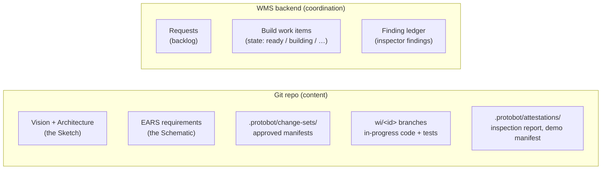

# ProtoBot scenarios — how the pipeline runs in practice

Two walkthroughs, each one a real situation. They both use the same
phases and the same records; only the entry point differs.

1. [Scenario 1 — New project from an idea](01-new-project.md) — you have
   an idea (IdeaBot output), nothing exists yet. Full pass through all
   four phases, with the concrete inputs and outputs of each phase.
2. [Scenario 2 — A new request on an existing prototype](02-add-feature.md) —
   the prototype exists and there is a backlog; you want something new.
   Where the feature request lives, who decides which phase it triggers,
   and what happens when the request is **undefined**, **changes**, or
   **contradicts**.

Everything here is a simplified view of
[user-interaction-flow.md](../architecture/user-interaction-flow.md) and
[components.md](../architecture/components.md) — those stay the source of
truth.

## The three records (terminology)

What you would casually call a "feature request" is a **request** in
ProtoBot terms. It is one of three distinct records:

| Record | What it is | Where it lives |
|---|---|---|
| **Request** | "I want it to do X" — intent, rationale, business priority | **WMS backend** (a Jira/GitHub/GitLab issue, Trello card, …) |
| **Change set** | The reviewed specification delta produced from a request | **Git** — on a branch while proposed; manifest in `.protobot/change-sets/` on `main` once approved |
| **Build work item** | The delivery contract the autonomous phase executes | **WMS backend** (one issue per item); its code on a `wi/<id>` git branch |

## Where every artifact lives

The rule of thumb: **content lives in git, coordination lives in the WMS.**

| Artifact | Where exactly |
|---|---|
| Vision, Architecture | Git `main` — prose files at paths configured in `.protobot/project.yaml`, written only through `ears-manager` |
| EARS requirements | Git `main` — the requirement store (format tentatively JSONL) |
| Draft spec changes (pre-approval) | Git — a branch with an open PR |
| Approved change-set manifests | Git `main` — `.protobot/change-sets/` |
| Requests | WMS backend |
| Build work item state | WMS backend |
| In-progress code and tests | Git — the work item's `wi/<id>-<slug>` branch |
| Findings during Inspecting | Append-only finding ledger behind the WMS boundary |
| Inspection snapshot + report, demo manifest | Git — `.protobot/attestations/` on the `wi/` branch, merged to `main` on completion |
| Completed prototype (code + tests + specs) | Git `main` |
