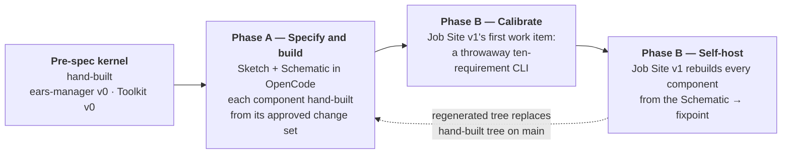
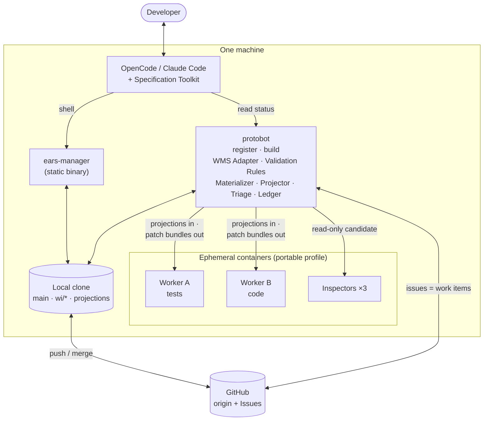

# ProtoBot Version 1 — Self-hosting architecture

> **Status: proposal, 2026-09-03.** This document answers one question:
> *how do we build ProtoBot so that ProtoBot builds itself, and what does
> the first version look like as a result?* It sits on top of John
> Strunk's design proposal in [`../architecture/`](../architecture/) and
> the owner's later notes in [`../my-architecture/`](../my-architecture/)
> and [`../../lukas-feedback.md`](../../lukas-feedback.md). It does not
> edit any of them. Where it narrows or contradicts the proposal it says
> so and why. Citations are `file:line` into `docs/architecture/` as it
> stands today.
>
> **Revised 2026-09-03.** The first draft climbed a four-stage bootstrap
> ladder in which ProtoBot built every one of its own components. This
> revision replaces that with *build from the Schematic, then prove
> self-hosting once*. The comparison that decided it is in
> [The problem self-hosting creates](#the-problem-self-hosting-creates).

**Contents:**

- [The problem self-hosting creates](#the-problem-self-hosting-creates)
- [The answer: specify, hand-build, then self-host](#the-answer-specify-hand-build-then-self-host)
- [What "self-hosted" means, testably](#what-self-hosted-means-testably)
- [Version 1 shape](#version-1-shape)
- [The five components in Version 1](#the-five-components-in-version-1)
- [ProtoBot as a ProtoBot project](#protobot-as-a-protobot-project)
- [Delivery plan: change sets in order](#delivery-plan-change-sets-in-order)
- [Self-hosting wrinkles](#self-hosting-wrinkles)
- [Decisions Version 1 forces](#decisions-version-1-forces)
- [Out of scope](#out-of-scope)

---

## The problem self-hosting creates

The scope statement is clear about *what* the first project builds: the
Specification Toolkit, `ears-manager`, a WMS Adapter for GitHub Issues,
a Job Site, and the Validation Rules. It is silent about the paradox
those five items create: **the tool that is supposed to build them does
not exist until they are built.** A Job Site cannot claim a work item
without a WMS Adapter; a work item cannot exist without an approved
change set; a change set cannot be written without `ears-manager`; and
Dimensioning cannot start without the Toolkit's skills.

Compilers solve exactly this with a *bootstrap*: a small hand-written
stage that is just good enough to compile a better stage, repeated until
the compiler compiles itself and the hand-written stage is thrown away.
The obvious translation is a ladder — a tiny hand-built kernel, a
one-script Job Site that builds the real tools, the real Job Site
building itself. Version 1 does **not** do that. The two variants look
further apart than they are: both have a hand-built stage, and the whole
question is where the hand-built line sits. The ladder puts it at "just
enough to start Dimensioning"; the alternative puts it at "everything
through the Job Site", and makes the first ProtoBot-built thing the
rebuild of ProtoBot.

| Dimension | Ladder: ProtoBot builds every component | Build first, then self-host |
|:--|:--|:--|
| Failure attribution | The first work item fails with five immature suspects at once: spec, Toolkit, Job Site v0, sandbox, model | Components are built and tested conventionally. A failed work item has two suspects: spec and model |
| Time to a working ProtoBot | Long. Every component passes through the weakest Job Site with the weakest Workers | Days per component with a coding agent |
| Time to first ProtoBot-built artifact | Earlier, but it is a toy building a tool | Later, at the fixpoint, with a real tool |
| Spec-as-product | Violated only for the kernel, which is deleted | Violated for everything until the fixpoint passes. Without the fixpoint, ProtoBot's own repository breaks ProtoBot's own principle for good |
| Eval data | Early, on a toy, with no baseline. Mostly noise | At the fixpoint: same spec, one hand-built and one generated implementation, same test catalog. Directly comparable |
| Toolkit and `ears-manager` dogfooding | In Dimensioning | Identical, provided the Schematic is written first |
| Job Site dogfooding | Forced from day one, on the hardest target | Lost, unless a small calibration target is added |

The ladder's merit is that it proves the Job Site works by making it
work. Its cost is that it confounds every early failure and spends most
of the calendar debugging a pipeline against a moving target. The scope
statement's purpose — validating "under real-world conditions during
construction" — is met either way for the Toolkit and `ears-manager`,
because both are used to write the Schematic. So Version 1 takes the
second column, under three rules (below) that keep it from degrading
into "write code, reverse-engineer a spec", where the fixpoint proves
nothing because a spec written from code always regenerates that code.

Two constraints from the proposal still shape the plan:

- **The specification is the product** (overview.md:60–76). The hand-built
  tree is therefore a *reference implementation*, not the release. The
  release is whatever ProtoBot regenerates from its own Schematic.
- **Every agentic component must be independently evaluable**
  (overview.md:94–98). The calibration project and the fixpoint must
  leave behind recorded inputs and outputs, because they are the first
  eval dataset.

---

## The answer: specify, hand-build, then self-host

Two phases. In Phase A the human, with an ordinary coding agent, writes
ProtoBot's Schematic and builds every component from it. In Phase B
ProtoBot builds — first a calibration target, then itself. The human
acts as the reviewer at the boundary the proposal already defines in
both phases; what changes between them is who writes implementation
code.



| Phase | Who builds it | With what | Leaves behind |
|:--|:--|:--|:--|
| **Pre-spec kernel** | Human, with an ordinary coding agent (Claude Code / OpenCode), **outside** the ProtoBot pipeline | Nothing | The two things Dimensioning cannot start without: `ears-manager` v0 (the write path only) and Toolkit v0 |
| **A — Specify and build** | Human + agent in OpenCode for Sketching and Dimensioning; a coding agent for the code, working from one approved change set at a time | The kernel, then each component as it lands | ProtoBot's Vision, Architecture, interface records and EARS requirements as approved change sets on `main`; `ears-manager` v1, Validation Rules, WMS Adapter, execution backend and `protobot` v1, each hand-built from its change set with a PR that cites requirement IDs |
| **B — Calibrate and self-host** | Job Site v1, autonomous | Phase A | Attestations from the calibration project and from the ProtoBot-built work items; then a passing fixpoint test, after which the regenerated tree replaces the hand-built one on `main` |

The phase boundary is not a calendar milestone; it is **who writes
implementation code**. Phase B begins the moment Job Site v1 claims its
first work item. After the fixpoint passes, no hand-written
implementation lands on `main` again.

### The three rules that make hand-building sound

1. **Spec first, code second.** No component is started until its change
   set is approved — CS-2 through CS-6 in the
   [delivery plan](#delivery-plan-change-sets-in-order). Each PR cites
   the requirement IDs it implements. Anything in the code that is not
   traceable to a requirement is not a requirement, and may not survive
   the rebuild; the fixpoint is where that is found out, and finding it
   there is the point.
2. **A calibration project before self-hosting.** Job Site v1's first
   real work item is a throwaway target — a ten-requirement CLI in its
   own project — not ProtoBot. This recovers the ladder's one genuine
   advantage, a Job Site proven on a live work item, for a day's cost,
   and when it fails there are two suspects instead of five.
3. **The fixpoint is the definition of done, not an option.** On pass,
   the regenerated tree replaces the hand-built one on `main`; the
   hand-built tree survives only in history. The overview permits this:
   everything except the specification is regenerable
   (overview.md:73–76) — it does not say everything must *have been*
   generated. Skipping the fixpoint is the one way this plan ends up
   worse than the ladder.

### The pre-spec kernel

Two items, written before any specification exists because Dimensioning
needs them to run at all:

- `ears-manager` v0 supports `check`, `add requirement`, `add interface`,
  `artifact put/get`, `change-set`, `list`, `show`. No `compare`, no
  `impact`, no `update`, no `retire`. Dimensioning writes a greenfield
  Schematic; nothing exists yet to compare against or to impact. It is
  replaced by the hand-built v1 as soon as CS-2 is approved, and v1 is
  the first component built under rule 1.
- Toolkit v0 is two skills, Sketching and Dimensioning, in the
  proposal's own words (user-interaction-flow.md:161–355), plus the EARS
  pattern table and the interface-type taxonomy as reference files. It
  is not replaced but evolved — see wrinkle 3.

There is no Job Site v0 and no file-backed stand-in WMS. Nothing is built
autonomously before Job Site v1 exists, so nothing needs to be claimed
before the adapter exists.

---

## What "self-hosted" means, testably

"ProtoBot builds itself" is a slogan until it has a pass/fail check. The
check is the compiler bootstrap's fixpoint, translated:

> **Fixpoint test.** On a fresh branch cut from `main`, discard every
> `implementation`- and `test`-classified path, keep only the Schematic
> and the `.protobot/` control namespace, and run Job Site v1 over one
> work item per component in dependency order. Self-hosting holds when
> every regenerated component passes the active test catalog, every
> Inspector clears, and the resulting conformance evidence names the
> same requirement IDs at the same specification commit as the evidence
> already on `main`.

Three things this test is deliberately **not** demanding:

- **Not byte-identical output.** Two runs of a model produce different
  code. The proposal already defines equality at the level of observable
  behavior (overview.md:78–84); the fixpoint compares *evidence*, not
  trees.
- **Not zero human involvement.** A rebuild may block on an escalation
  (undefined behavior, infeasible requirement). That is the pipeline
  working, and each escalation is a Dimensioning defect to fix in the
  Schematic, not a fixpoint failure — provided the next attempt passes.
- **Not the Toolkit.** The Toolkit is prompts and skills, not code. It is
  not regenerated by the Job Site; it is *evaluated* (see
  [Self-hosting wrinkles](#self-hosting-wrinkles)).

The fixpoint test is also the answer to the question the proposal leaves
implicit: what is Version 1's definition of done? **Version 1 is done
when the fixpoint test passes once.** Everything after that is Version
1.x.

---

## Version 1 shape

Version 1 is single-player, single-machine, single-project, single-WMS.
The scope statement's non-goals say so, and the fixpoint needs it: a
rebuild with a cluster, a web UI and multi-tenancy in the loop would
never pass.

That narrows the owner's Drafting Table direction of 2026-09-03 —
one React application delivered as web and Electron, multi-tenant from
the start ([`drafting-table.md`](../my-architecture/drafting-table.md))
— **for Version 1 only**. The TUI Drafting Table (OpenCode with the
Toolkit loaded) is Version 1's only Drafting Table, exactly as non-goal
1 states. The React/Electron application is the first *post*-self-hosting
project, and it is a good one precisely because by then ProtoBot can
build it. The tenant- and project-scoped authorization context that
`drafting-table.md` insists on from the first line of code applies to
that project, not to Version 1's CLI.

### Process inventory

| Piece | Version 1 form | Runs where |
|:--|:--|:--|
| Drafting Table | OpenCode (or Claude Code) with the Toolkit loaded as skills | Developer's machine |
| Specification Toolkit | A directory of markdown skills + tool definitions, versioned in this repo | Loaded into the harness |
| `ears-manager` | One static binary, `ears-manager` | Everywhere: laptop, CI, both Worker sandboxes, integration |
| Validation Rules | A declarative state table + one small interpreter library | Linked into `protobot` |
| WMS Adapter | A package inside the `protobot` binary; GitHub Issues backend + a file-backed reference backend | Inside `protobot` |
| Job Site control plane | The `protobot` binary: `register`, `build --once`, `build --loop` | Developer's machine (v1); CI later |
| Workers, Inspectors | Ephemeral containers spawned by `protobot build` | Local container runtime |
| Execution backend | An `ExecutionBackend` interface with the portable rootless-OCI profile first, Fullsend and direct OpenShell behind the same interface | See [Job Site](#job-site) |

Two binaries, one skill directory, one external system (GitHub). No
service is long-running unless `build --loop` is started on purpose.



---

## The five components in Version 1

Each component below states what Version 1 keeps from the proposal, what
it defers, and how it is verified. "Keeps" is the default; only the
departures are argued.

### Specification Toolkit

**Keeps:** harness-agnostic skills + tool definitions + prompts
(components.md:224–257); two runtime dependencies only, `ears-manager`
and the WMS (components.md:246–251).

**Version 1 form.** A directory of markdown skills, because that is what
both OpenCode and Claude Code load natively and it answers the packaging
open question (components.md:271–274) with the cheapest option:

```text
toolkit/
├── skills/
│   ├── intake/SKILL.md          # dedupe, classify, confirm intent (Phase B)
│   ├── sketching/SKILL.md       # Vision + Architecture + interface records
│   └── dimensioning/SKILL.md    # EARS per interface, gap surfacing, impact review
├── reference/
│   ├── ears-patterns.md         # the six templates and the test approach per pattern
│   ├── interface-types.md       # the taxonomy; CLI = the one v1 needs
│   └── architecture-rules.md    # what belongs in the Architecture, verbatim from the proposal
└── tools/
    ├── ears-manager.md          # how to call the CLI; the agent never edits spec files
    └── wms.md                   # gh CLI usage for requests and blocked items
```

Tool definitions are **shell instructions, not MCP servers**, in
Version 1. Both harnesses can run a binary; an MCP server for
`ears-manager` is a Version 1.x convenience once the CLI surface is
stable.

The Intake skill exists from Phase B onward, when ProtoBot has a
backlog of its own. It follows the request state machine in
[`drafting-table.md`](../my-architecture/drafting-table.md) but its
records are GitHub issues labelled `request`, and the Intake skill is
the consumer the proposal's Requests API lacks (components.md:585–590).

**Defers:** Kits (non-goal 4); the web harness; MCP packaging.

**Verified by:** evals, not tests — see
[Self-hosting wrinkles](#self-hosting-wrinkles). Each skill ships with a
`fixtures/` directory of recorded inputs and reference outputs from the
Phase A Dimensioning sessions, replayable with the Agent Eval Harness
(related-work.md:305–317).

### `ears-manager`

**Keeps:** deterministic, not AI-driven; a single static binary; the
single write gate for every registered specification artifact; format
abstracted behind subcommands (components.md:472–492). The full
subcommand table (components.md:372–385) is the Version 1 target.

**Version 1 storage: one file per requirement, not JSONL.** The proposal
tentatively picks JSONL and then lists exactly why it may not survive
(user-interaction-flow.md:329–341). Version 1 decides it, because
Dimensioning writes the store before any component is built, and
changing the layout afterwards is a migration every hand-built component
would have to carry:

```text
spec/
├── vision.md                        # prose; registered via `artifact put`
├── architecture.md                  # prose + diagrams-as-code
├── interfaces/
│   ├── ears-manager-cli.yaml        # interface record: id, type, spec artifact, owner
│   └── ears-manager-cli.usage.kdl   # the CLI IDL (see decisions)
├── requirements/
│   ├── REQ-EM-001.yaml              # one requirement = one file
│   └── REQ-EM-002.yaml
└── .protobot/change-sets/
    └── CS-0003.yaml                 # immutable once approved
```

Why: two Dimensioning sessions touching different requirements never
conflict; a revision is a one-file diff a reviewer can read in a PR; and
cross-references and relationships are ordinary fields, not line-number
arithmetic. The cost is more files, which is what `ears-manager list`
exists to hide. The schema of a requirement file is the proposal's JSON
example (user-interaction-flow.md:291–306) as YAML, with `relationships`
added.

**Version 1 EARS strictness (components.md:510–513):** exact keyword
match on the six templates, case-insensitive, with the `<system>` name
required to be an interface ID or the project selector. Strict is the
right default when the writer is an agent: the agent adapts to the
linter in one turn, and every relaxation is a permanent hole.

**Defers:** `impact` beyond interface/scope intersection (semantic impact
is the Dimensioning agent's job anyway); validator plugins beyond
"a command that exits non-zero".

**Verified by:** its own test suite, hand-written against CS-2's
requirements in Phase A and regenerated by Worker A at the fixpoint.
`ears-manager check` is a CI gate on every branch from CS-1 onward.

### WMS Adapter

**Keeps:** thin translation; the uniform Adapter API (components.md:577–626);
work-item state in the tracker, content in git (components.md:721–757);
one active backend per project.

**Version 1 backends: two, on purpose.**

1. **GitHub Issues** — the product backend, as scoped. One issue per
   build work item, one per request, distinguished by a label and a
   `record_type` field in the issue's YAML front-matter block
   (lukas-feedback item 9).
2. **File-backed reference adapter** — one JSON document per record on a
   `protobot/wms` branch. It exists because it is the only backend
   ProtoBot's own CI can run against
   without a live tracker (lukas-feedback item 1). It is a
   conformance-suite fixture, not a supported deployment.

**The atomic claim problem.** GitHub Issues has no compare-and-swap; the
proposal hedges with "or an external coordinator" (components.md:539).
Version 1's coordinator is **git itself**: a claim is a ref update on
`refs/protobot/leases/<work-item>` pushed with `--force-with-lease`,
which every git host executes atomically per ref. The issue carries the
*displayed* state; the ref carries the *authoritative* lease, owner and
fencing token. This satisfies the adapter contract on any git host with
no extra service, and the reference adapter uses the same primitive
locally, so the conformance suite tests the real mechanism.

In Version 1 there is exactly one Job Site instance, so the claim is
never contested. It is still implemented, because the conformance suite
is the deliverable that makes "pluggable" a checkable claim rather than
an aspiration, and because Version 1.x adds a second instance in CI.

**Conformance suite.** A single test package run against both backends:
create-or-return under a stable key, CAS claim writing owner/lease/token,
stale-token rejection, idempotent completion, append-only ledger events
with expected-version checks. It is written with the adapter in Phase A,
regenerated by Worker A at the fixpoint, and is the acceptance test for
every later backend.

**Defers:** Jira, GitLab, Beads, Trello (non-goal 2); the transactional
outbox (components.md:622–626) — with one control-plane process and a
file-based ledger there is nothing to make atomic across systems.

### Validation Rules

**Keeps:** shared, enforced at the write boundary, not duplicated per
backend (components.md:1065–1112); rule version recorded on every
decision.

**Version 1 form: a state table plus a tiny interpreter.** The
proposal's packaging question — code, declarative schema, or prompt
(components.md:1126–1131) — is answered "declarative", for a reason
specific to this repo: the languages are not settled (see
[decisions](#decisions-version-1-forces)), and a YAML state table with a
fixture set is the one form that survives whichever way that goes. If
the control plane and the adapter end up in one language, one
interpreter loads it; if they split, two interpreters load it and the
shared fixtures prove they agree.

```yaml
# rules/work-item.yaml — the state diagram at components.md:633-661 as data
record: build-work-item
version: 1
states: [waiting, ready-for-building, building, inspecting, blocked, merging, completed, abandoned]
transitions:
  - from: ready-for-building
    to: building
    action: claim
    requires: [expected-version, new-fencing-token, lease]
  - from: building
    to: inspecting
    action: tests-passed
    requires: [fencing-token]
  # ...
```

Version 1 has one table, the build work item. The request state machine
from `drafting-table.md` is a second table added with the Intake skill.

**Verified by:** a fixture set of (state, command, context) → (allowed |
rejected, reason) triples. The Job Site and adapter tests both consume
it.

### Job Site

This is where Version 1 departs most from the proposal, and where the
departure is mostly *subtraction*. The proposal's Job Site
(components.md:1135–1491) is the design for a hosted, multi-instance,
multi-project engine. Version 1 needs the parts of it that carry the
architectural bet, and none of the parts that carry scale.

**Keeps, non-negotiable:**

- **Dual-model isolation through repository projections**
  (components.md:934–973). This is the one claim ProtoBot exists to
  test; without it there is no reason to build ProtoBot rather than use
  Forge or Fullsend. Version 1 exports allowlisted paths from the source
  commit into a fresh `git init` per Worker, exactly as decided, and
  runs the negative isolation tests (components.md:1022–1036) as part of
  every `protobot build`.
- **Patch bundles in, never a shared checkout** (components.md:1011–1020),
  with path-ownership validation on import.
- **The triage sanitizer** (components.md:1038–1061). The allowlist is
  the whole point; a Version 1 that leaked test assertions to Worker B
  would produce green builds that mean nothing.
- **Merge commits, history preserved** (components.md:922–932). The
  iteration history is the eval dataset.
- **The canonical test catalog with `verifies` metadata**
  (components.md:975–1003). Quarantine of tests mapped to revised
  requirements is what makes the fixpoint rebuild meaningful.
- **Three Inspectors:** Security, Test Completeness, Code Quality
  (user-interaction-flow.md:683–703). Each an independent container with
  a read-only candidate.
- **Escalation on undefined behavior**, as a GitHub issue that blocks
  the work item (components.md:1660–1680).

**Reduces:**

- **Materializer and Dispatcher become two subcommands** (lukas-feedback
  item 8): `protobot register <change-set>` is run by a `post-merge` hook
  in single-player mode and reads the manifest at `HEAD`;
  `protobot build --once` claims the highest-priority ready item and
  runs it to completion or block. `--loop` is the same thing repeated.
  Nothing is a daemon unless you ask.
- **Finding ledger is a JSONL file** under `.protobot/attestations/` on
  the `wi/` branch, appended only by the control plane. With one writer
  the append-only, idempotency-key and expected-version machinery
  (components.md:1293–1385) collapses to "append a line". The record
  *shape* is kept verbatim so that the hosted ledger is a backend change,
  not a schema change.
- **Inspection Run manifest and sealing** are kept in reduced form: a
  manifest with the candidate commit and product-tree digest, and a seal
  that is the three Inspectors' completion events. The independence
  policy (different principal, session and model class) is recorded but
  not enforced in Version 1; it is enforced when a second model provider
  is configured.
- **Scheduling** is business priority, then dependencies, then aging.
  Nothing else exists to schedule against in a one-instance deployment
  ([`lack-of-work-item-prioritization.md`](../my-architecture/lack-of-work-item-prioritization.md)
  covers what the full policy needs).

**Defers, explicitly:**

- **Mutation testing as a gate.** The Inspector-only disposition
  protocol (user-interaction-flow.md:587–619) needs two independent
  Inspectors per survivor and a per-language operator set. Version 1
  runs a Go/TypeScript mutation tool as a **reported metric** in the
  attestation, not a gate. This is the one place Version 1 knowingly
  lets a proposal-mandated hidden audit through, and it is the first
  Version 1.x item because the metric will tell us how much it matters.
- **Implementation-aware test Worker.** Every requirement in the
  Schematic is written `isolated-interface`; a CLI is the interface type where that
  is easiest to honour. If Dimensioning finds a requirement that needs
  the exception, that is a finding about the Schematic first.
- **Lease renewal, reconciliation after crash, abandoned-state guards.**
  One instance, one developer watching it. A crashed `build --once` is
  rerun; the `wi/` branch and the ledger file tell it where it was.

**Execution backend — the ordering argument.** The scope statement says
Fullsend first, direct OpenShell as fallback. Version 1 keeps both
behind one interface but **runs the calibration project and the fixpoint
on the portable profile**, for reasons that are facts rather than
preferences:

- Fullsend's one hard prerequisite is OpenShell: `fullsend run` refuses
  to start without the binary and a running gateway
  (`~/Projects/Github/redhat/fullsend`, `internal/cli/run.go:1192`, at
  commit `2a103497`). Claude Code on Vertex is the stable default, with
  `pi` and `codex` runtimes experimental (`docs/guides/getting-started/choosing-a-runtime.md:7`);
  mint enrollment is optional (`action.yml:44`, empty default; GitLab
  needs none). Each `fullsend run <agent>` already gets its own sandbox
  (`run.go:1245`); what is roadmap is auto-merge and per-*stage*
  sub-agent sandboxes (`docs/roadmap.md:19,46`). OpenShell was rejected
  on Managed Platform Plus for needing `CAP_SYS_ADMIN` (hermes ADR-0004).
- Fullsend's integration surface is the GitHub Action and the
  `fullsend run <agent>` CLI, which runs one whole agent from its harness
  YAML. There is no library or HTTP API for "run this role in a sandbox
  and return a bundle"; host-side APIs for sandboxes are roadmap
  (`docs/roadmap.md:30`). So the spike is an adapter that wraps a whole
  Fullsend agent run per role, not a call into a sandbox primitive.
- The proposal itself names the portable rootless-OCI/microVM profile
  as the *required* fallback and says the Job Site must refuse to run
  on a backend that fails the acceptance suite (components.md:1703–1777).
  A self-hosting rebuild cannot have its only execution path be an
  integration spike into a system that may not pass.

So the interface comes first, the portable profile is the backend the
fixpoint runs on, and the Fullsend spike is a **Phase B work item** —
built by ProtoBot, against the interface, evaluated by the same
acceptance suite. That ordering also makes the spike a real test
of the backend abstraction rather than the thing the abstraction is
reverse-engineered from.

```go
// The contract every backend implements. Portable profile first.
type ExecutionBackend interface {
    // Run executes one role (worker-a, worker-b, inspector/<name>) in a fresh
    // sandbox seeded with the given projection bundle, under the network and
    // filesystem policy for that role, and returns a patch bundle or findings.
    Run(ctx context.Context, role Role, projection Bundle, policy Policy) (Result, error)
    // Acceptance runs the isolation, network and credential negative tests
    // from inside a sandbox. The Job Site refuses a backend that fails it.
    Acceptance(ctx context.Context) (Report, error)
}
```

The portable profile in Version 1 is rootless Podman with `--network
none` for Workers plus a single egress proxy container that allowlists
the package registry and the model endpoint per role. Credentials never
enter a sandbox: the proxy holds the model key and Workers talk to
`http://proxy/v1`. That is the Bridge/Gate pattern (related-work.md:229–232)
at laptop scale.

**Verified by:** the isolation acceptance suite (run on every build),
the conformance suite against the reference adapter (CI), and — the
only end-to-end test that matters — the fixpoint test.

---

## ProtoBot as a ProtoBot project

Phase A opens with a Sketching and Dimensioning session whose subject is
ProtoBot. The proposal's rule for what belongs in the Architecture
(user-interaction-flow.md:195–245) applied to ProtoBot gives this
interface list. It is the list the first Sketching session should
produce, written here so that session has something to disagree with.

| Interface | Type | Why it is external | Spec approach |
|:--|:--|:--|:--|
| `ears-manager` CLI | CLI | Used by agents, CI and humans | CLI IDL (see decisions) |
| `protobot` CLI | CLI | Run by hooks, CI and humans | CLI IDL |
| Specification store on disk | Persistent state | Outlives every run; read by `ears-manager` only, but its layout is what git diffs and reviewers read | Schema per file kind |
| `.protobot/` control namespace | Persistent state | Read by CI, the Job Site and reviewers | Schema per file (components.md:733–741) |
| WMS Adapter API | Pluggable component boundary | "If you would support a third party creating a plug-in implementation… it is an external interface" (user-interaction-flow.md:209–211) | Interface definition + conformance suite |
| Execution backend contract | Pluggable component boundary | Same rule; Fullsend, OpenShell and the portable profile all implement it | Interface definition + acceptance suite |
| GitHub Issues mapping | Persistent state (in an external system) | The record layout humans see in the tracker | Schema for labels + front-matter |
| Toolkit skill format | Consumed contract | Loaded by third-party harnesses | Directory convention + fixture format |

**Environmental requirements** (not interfaces, still in the
Architecture): static single-binary distribution for `ears-manager`;
no cluster required; UBI base images for any container ProtoBot ships;
credentials never in a sandbox; the projection manifest is authoritative.

The projection manifest for ProtoBot's own repository is the first
non-trivial one ever written, and it is worth seeing because it shows
the self-hosting twist — the Toolkit is `shared`, because both Workers
need to read the process they are part of, but nothing may write it:

```yaml
# .protobot/projection.yaml — deny by default
version: 1
paths:
  - {glob: "spec/**",                 class: shared}
  - {glob: "toolkit/**",              class: shared,          writable-by: []}
  - {glob: "rules/*.yaml",            class: shared}
  - {glob: "cmd/**",                  class: implementation}
  - {glob: "internal/**",             class: implementation}
  - {glob: "test/**",                 class: test}
  - {glob: "test/catalog.jsonl",      class: test}
  - {glob: ".protobot/attestations/**", class: attestation-only}
  - {glob: ".protobot/wms/**",        class: integration-only}
  - {glob: "docs/**",                 class: integration-only}
```

---

## Delivery plan: change sets in order

One approved change set materializes one work item (user-interaction-flow.md:147–155).
Lukas-feedback item 3 warns that a greenfield first item is "the whole
Schematic in one agent's context". The plan avoids that by making
**each component its own change set**, in dependency order, so no work
item — hand-built in Phase A or regenerated at the fixpoint — is larger
than one binary's worth of requirements. The order is also the
dependency graph: each item's `depends-on` is the row above.

| # | Change set | Phase | Built by | Implementation effect | Replaces |
|:--|:--|:--|:--|:--|:--|
| CS-0 | *(none — pre-spec kernel, hand-built)* | kernel | Human + coding agent | `ears-manager` v0, Toolkit v0 | — |
| CS-1 | ProtoBot Vision + Architecture + interface records | A | Sketching in OpenCode | **None** (declared, per overview.md:165–166) | — |
| CS-2 | `ears-manager` requirements (full subcommand set, storage schema, EARS strictness) | A | Coding agent from CS-2; PR cites requirement IDs | **`ears-manager` v1** + its test suite | `ears-manager` v0 |
| CS-3 | Validation Rules requirements (state table, interpreter, fixtures) | A | Coding agent from CS-3 | **rules package** + fixtures | — |
| CS-4 | WMS Adapter requirements (API, conformance suite, GitHub Issues + reference backends, git-ref claim) | A | Coding agent from CS-4 | **adapter package** + conformance suite | — |
| CS-5 | Execution backend contract + portable profile + acceptance suite | A | Coding agent from CS-5 | **backend package** + acceptance suite | — |
| CS-6 | Job Site control plane requirements (`register`, `build`, projector, patch import, triage + sanitizer, ledger, Inspectors, catalog, merge) | A | Coding agent from CS-6 | **`protobot` v1** | — |
| CAL | Calibration project: a throwaway ten-requirement CLI in its own project | B | **Job Site v1** — its first work item | WI-0: the calibration CLI, plus the first attestation | — |
| CS-7 | Intake skill + request state table | B | Dimensioning; Job Site v1 for the table | WI-1: request rules | — |
| CS-8 | Fullsend integration spike behind the backend contract | B | Job Site v1 | WI-2: Fullsend backend | — |
| CS-9 | Direct OpenShell backend | B | Job Site v1 | WI-3: OpenShell backend | — |
| — | **Fixpoint test** | B | Job Site v1 | Rebuild CS-2…CS-6's components from the Schematic on a fresh branch, one work item each | The hand-built tree on `main`, on pass |

Three things the table makes visible:

- **Phase A interleaves Dimensioning and building.** A component is
  hand-built as soon as its change set is approved, while the next
  component is being Dimensioned. Dimensioning is still "the most
  time-consuming interactive work" (overview.md:204), and for ProtoBot
  itself it is most of Version 1's calendar — but it is not a wall the
  whole build waits behind.
- **Hand-built PRs are held to the work-item contract.** Each PR names
  the change set it implements and the requirement IDs each test
  verifies, in the same `verifies` metadata the test catalog uses. That
  is what lets the fixpoint compare evidence rather than trees: the
  hand-built and regenerated implementations must cite the same IDs.
- **The calibration project is the cutover test.** Job Site v1 must
  claim and complete CAL before it is trusted with ProtoBot's own change
  sets, and the fixpoint runs only after CAL has passed. A failure in
  CAL has two suspects, the Schematic-writing process and the Job Site;
  a failure in the fixpoint without CAL would have had every component
  as a suspect at once.

Each `ears-manager check` and each conformance/acceptance suite runs in
CI from the commit that creates it. There is no test suite in this repo
today; CS-2's hand-built PR is the one that creates it, which is what
`.claude/rules/06-testing.md` already says will happen.

---

## Self-hosting wrinkles

Things that are true only because the project being built is ProtoBot.
Each is either handled or written down as a known Version 1 exposure.

**1. The spec-reading tool inside the sandbox is the hand-built
implementation of the thing under test.** Workers read requirements with
`ears-manager` (components.md:343–350). When the fixpoint work item *is*
`ears-manager`, Worker A is writing tests for a CLI while holding a
binary that implements all of it — an oracle-gaming vector the
proposal's projection rules did not anticipate. Handling: the Worker projections
receive a **restricted wrapper** exposing only `list`, `show` and
`artifact get`, so the behavior under test (`check`, `add`, `change-set`,
`compare`, `impact`) is not observable. Residual exposure: the output
format of `show` is visible. Recorded as an accepted Version 1 risk;
the mitigation for revised requirements is that the test must cite the
requirement text, which the Test Completeness Inspector checks.

**2. The hand-built tree is a reference implementation, not an
oracle.** At the fixpoint, every component has a hand-built version on
`main` that passes the same test catalog, and the temptation is to judge
the rebuild by "does it behave like the hand-built one". It must not be:
the rebuild is verified against the Schematic and the catalog only,
which is why the fixpoint branch discards every `implementation`- and
`test`-classified path before the first work item is claimed, so no
Worker projection can contain the hand-built code. The complementary
risk is the reverse direction — a Schematic quietly written *from* the
hand-built code, which would make the rebuild a tautology. Rule 1
(spec first, code second) is the only defence, and every hand-built PR
that adds a requirement rather than implementing one is a violation of
it to be caught in review.

**3. The Toolkit is not code and cannot be built by Workers.** Skills
are prompts; their correctness is "does a Dimensioning session with this
skill produce a complete Schematic", which is an eval, not a test.
Version 1 treats the Toolkit as **hand-maintained, versioned, and
evaluated**: every Phase A Dimensioning session is recorded as a fixture (input
description → produced artifacts), and a Toolkit change is accepted when
replaying the fixtures with the Agent Eval Harness does not regress. This
is the proposal's "Versioned and testable" principle (components.md:252–256)
with "testable" spelled out.

**4. One human wears every hat.** Single-player mode means the same
person authors the change set, approves it, and resolves escalations.
The review boundary is still real — `protobot register` refuses a
change set whose `ears-manager check` fails or whose impact candidates
lack dispositions — but the *independence* of review is zero. Version 1
records who approved each change set anyway, so the moment a second
person joins (multi-player, PR merge as the gate) nothing about the
records changes.

**5. The first eval dataset is the fixpoint, and it has a baseline.**
Cycle counts, triage accuracy and Inspector findings from the
calibration project and the Phase B work items are the first recordings
(components.md:1532–1538), and they should be *expected* to be bad and
*required* to be recorded. The fixpoint is the better dataset, and it is
one the ladder could never have produced: the same Schematic, the same
test catalog, one hand-built and one generated implementation per
component. Every later Toolkit, Worker-prompt or model change can be
measured as a fixpoint re-run against that pair. The proposal names Job
Site cycle count as the easiest first metric (components.md:1552–1554);
Version 1 writes it into every attestation from the calibration project
onward.

---

## Decisions Version 1 forces

These cannot be deferred past the pre-spec kernel and CS-1, because the
kernel and the Schematic embed them.
Each is stated with a recommendation; none is taken here.
`.claude/rules/10-tech-stack.md` records the current status of the
first two as undecided, and the change that decides them updates it.

**D1 — Implementation language for the code components.** The proposal
says Go, static binary (components.md:478–482); the scope statement says
"CLI tools, Go binaries"; this repository's owner declared **TypeScript
and Python** on 2026-08-19. These disagree. What Version 1 actually
requires is narrower than "a language": `ears-manager` must be a
single-file executable that runs unchanged in a laptop, a CI runner and
a locked-down sandbox with nothing installed. Go satisfies that
trivially; TypeScript satisfies it with `bun build --compile` or a Node
single-executable build; Python satisfies it least well. The Validation
Rules design above (a state table, not a library) is deliberately what
removes the "shared library forces one language" constraint, so D1 can
be answered per binary. *Recommendation:* Go for `ears-manager` and
`protobot`, because both live inside sandboxes and the proposal already
argued it; TypeScript for the post-Version-1 Drafting Table, where the
owner's React/Electron direction and the reusable `AgentRunner` and
checkpoint code in dex make it the obvious fit. Python only where an
existing tool demands it.

**D2 — Repository layout.** One repository or several. The projection
manifest, the fixpoint test and the "one change set per component" plan
all assume the components share one canonical repository, because a
work item's source commit is one commit. *Recommendation:* one
repository (`cmd/`, `internal/`, `toolkit/`, `spec/`, `rules/`, `test/`)
for Version 1; split later along the pluggable interfaces if a backend
grows its own release cadence.

**D3 — CLI interface IDL.** Open question 18 (open-questions.md:170–174)
lists `usage` (jdx.dev), docopt and `wasi:cli`. Version 1 needs one
*before* CS-1, because both of its interfaces are CLIs. *Recommendation:*
`usage` — it is a real spec format with a validator, it generates
completions and help (which turns "every subcommand shall provide
`--help`" into a checkable, generated property), and it is KDL, which
diffs well. Docopt is a parser, not a spec; `wasi:cli` is the wrong
level.

**D4 — Sketch and change-set file formats** (lukas-feedback items 6 and
7). The store layout above proposes YAML for interface records,
requirements and change-set manifests, and Markdown with
diagrams-as-code for Vision and Architecture. CS-1 cannot be written
until this is fixed. *Recommendation:* adopt as proposed; publish the
schemas beside `ears-manager` and version them from `1`.

**D5 — Model provider for Workers and Inspectors.** Not an architecture
decision, but the proxy container needs an endpoint before the
calibration project runs, and the Inspector independence policy needs a *second* provider
class eventually. *Recommendation:* start with one provider through the
egress proxy; record the provider and model in every attestation so the
first eval comparisons are possible when the second arrives.

---

## Out of scope

The scope statement's eight non-goals hold. Version 1 adds these,
each with the reason it is *not* merely deferred but excluded until the
fixpoint test passes:

- **Web or Electron Drafting Table, tenancy, hosted deployment.** The
  first thing ProtoBot should build once it can build things. Building
  it by hand would make the largest component of the system the one
  whose rebuild is never proven.
- **Mutation testing as a gate.** Runs as a metric; becomes a gate in
  1.x once the operator set and second Inspector exist.
- **Multiple Job Site instances, lease renewal, crash reconciliation.**
  The mechanisms are designed (git-ref CAS, fencing token in the
  contract) and the conformance suite tests them, but no second
  instance runs.
- **Demo artifacts beyond a `showboat` document per CLI.** The output
  type is CLIs; Asciinema and GIFs are cheap additions later.
- **HU-02 / AIA.** Nothing deploys and no customer sees a Version 1
  artifact. The records (who approved which change set, what the Job
  Site did with it) are kept in the form compliance will need.
- **TransferBot handover.** The Transfer Package — spec, acceptance
  tests, conformance report, demo artifacts, decisions log — is the
  natural output of a completed work item and should be defined as soon
  as one exists, but it is the third tool's contract to negotiate.
