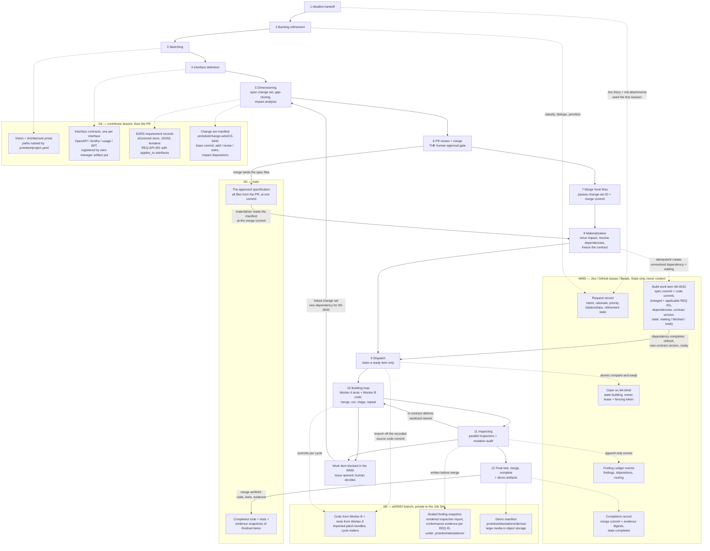
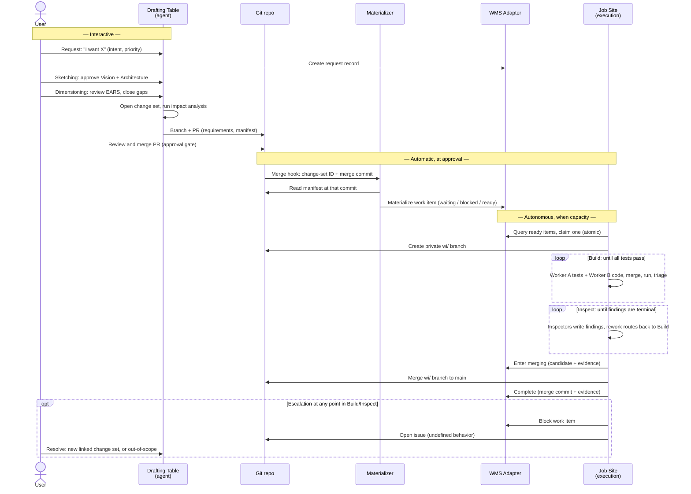

# ProtoBot: the whole process, with the invisible parts drawn in

> Written 2026-08-31 against John's revision `9a52f77` (27 Aug 2026). Every
> `file:line` points into `docs/architecture/` at that revision; the numbers
> move when he pushes again. This document explains what the design says —
> proposals to change it live in `Lukas feedback.md`.

The design documents describe the four phases in the phase order, but they
introduce the machinery (requests, change sets, work items, the materializer,
the merge hook) in other sections, far from the flow diagrams. This document
puts everything into one picture.

## 1. The model in three sentences

1. **Git holds content, the WMS holds state.** Specifications, code, tests and
   evidence live in the git repo; lifecycle state (what is ready, claimed,
   blocked, done) lives in the work management system — Jira, GitHub issues,
   Beads (`components.md:565-569`, `804-816`).
2. **Every build follows one path** — requirements → one approved change set →
   one build work item — including the very first build, where the change set
   simply adds everything (`components.md:775-780`, `1611`).
3. **The human's involvement ends at approval.** After the change-set PR
   merges, everything is autonomous until either the prototype merges to main
   or a question blocks the work item and comes back to the human
   (`user-interaction-flow.md:32-34`, `918-931`).

## 2. What "the specification" is

The phase text says *Sketch* and *Schematic*; the rest of the documents say
*specification*. They are the same thing at different zoom levels.

**The specification is everything on the four levels of the hierarchy, in the
git repo, at one commit:**

| Level | Phase that writes it | Artifact name | What it is |
|---|---|---|---|
| 1. Vision | Sketching | part of the **Sketch** | What, who, why — prose (`user-interaction-flow.md:85`) |
| 2. Architecture | Sketching | part of the **Sketch** | External interfaces and their types; persistent state; environmental constraints (`user-interaction-flow.md:195-245`) |
| 3. Interface | Sketching / Dimensioning | interface contract (IDL) | OpenAPI/Smithy for an API, `usage`/docopt for a CLI, WIT for a library (`user-interaction-flow.md:97-106`) |
| 4. Requirement | Dimensioning | the **Schematic** (all of them together) | Individual EARS records with metadata (`user-interaction-flow.md:289-306`) |

Where it lives, concretely:

- `.protobot/project.yaml` points to the Vision, the Architecture and
  interface IDLs, and the structured requirement store, wherever the project
  puts them (`components.md:743-745`).
- The requirement store is tentatively JSONL — one record per requirement,
  stable IDs like `REQ-AUTH-001` (`user-interaction-flow.md:289-306`).
- `.protobot/change-sets/<id>` holds one immutable manifest per approved
  change set — the audit history of how the specification got to its current
  state (`components.md:739`, `417-431`).
- `ears-manager` is the only thing allowed to write any of it
  (`components.md:745-748`).

A **specification commit** is nothing special — it is a git commit hash. When
a work item "freezes the specification", it records that hash
(`user-interaction-flow.md:1058`). The current Schematic is what you get by
applying all approved change sets (`user-interaction-flow.md:243-244`).

So "a change to the specification" means: add, revise or retire requirements,
or change the Vision, Architecture or an interface contract. All of it goes
through a change set — Sketch updates are regular work items too
(`components.md:834-836`). "The specification is the product"
(`overview.md:60-76`): code and tests are regenerable from it; it is the one
artifact that is not disposable.

## 3. What each activity produces

The phases hide two activities (backlog refinement, interface definition) and
one automatic step (materialization). All of them, in order, with their
outputs:

| # | Activity | Output | Lives in |
|---|---|---|---|
| 0 | IdeaBot handoff | Research artifacts that seed the first Sketching session (`overview.md:51-56`) | Jira Story + attachments (hermes side) |
| 1 | Backlog refinement | A refined **request**: classified (undefined / changes / contradicts), deduplicated, prioritized, owned (`user-interaction-flow.md:853-863`) | WMS |
| 2 | Sketching | The **Sketch** = Vision + Architecture. The Architecture **names every external interface and its type** — API, CLI, GUI, persistent state, pluggable boundary — plus environmental constraints (`user-interaction-flow.md:192-245`) | Git |
| 3 | Interface definition | One **contract artifact (IDL) per interface**, format chosen by type: OpenAPI/Smithy for a network service, `usage`/docopt for a CLI (unevaluated), WIT for a library; REPL and GUIs have no format yet (`user-interaction-flow.md:97-106`). Registered through `ears-manager artifact put`, which runs a per-format validator (`components.md:377`, `408-412`) | Git |
| 4 | Dimensioning | The approved **change set**: EARS requirement records, each bound to interfaces through `applies_to.interfaces`, plus the manifest with the impact assessment (`user-interaction-flow.md:280`, `291-306`) | Git — PR, then `main` |
| 5 | Approval (PR merge → hook → materializer) | The **build work item** with the frozen contract | WMS |
| 6 | Building | Code + tests that pass together on the `wi/` branch, and the iteration history in commit trailers (`components.md:1010-1020`) | Git (`wi/`) |
| 7 | Inspecting | Sealed finding snapshot, rendered inspection report, and per-requirement **conformance evidence** (`components.md:793-798`) | Git (`wi/`); ledger events behind the WMS |
| 8 | Completion | The merge commit on `main`; the WMS completion record pairing evidence digests with it; **demo artifacts** and their manifest under `.protobot/attestations/demos/` (`user-interaction-flow.md:805-837`) | Git + WMS |

Two things worth knowing about row 3:

- The documents never assign interface definition to a phase. Sketching names
  and types the interfaces; the contract artifact appears "infrequently"
  between Sketching and Dimensioning (`overview.md:230-232`), written through
  `ears-manager` like every other specification artifact
  (`components.md:178-180`).
- Nothing forces the contract to exist before requirements are approved
  against the interface. A change set can be approved for a web UI whose
  contract format is an admitted open gap — that is `Lukas feedback.md`
  item 2 (b).

## 4. The four records

| | Requirement | Request | Change set | Build work item |
|---|---|---|---|---|
| Unit of | one behavior | intent | one reviewed spec change | one build |
| Made by | human + agent (Dimensioning) | human + agent (backlog) | agent opens, human approves | materializer, automatic |
| Lives in | Git (requirement store) | WMS | Git (`.protobot/change-sets/`) | WMS |
| Holds | EARS text, interfaces, verification mode | intent, rationale, priority, relationships | base commit, add/revise/retire of requirement IDs, impact dispositions | frozen contract: commits, requirement IDs, dependencies, state, lease |
| Source | `user-interaction-flow.md:291-306` | `overview.md:210`, `user-interaction-flow.md:845-847` | `components.md:421-431` | `user-interaction-flow.md:1051-1069` |

Two rules connect them: a change set names **requirements**, never requests
(`components.md:424-426`); the WMS links a request to **its** change set — the
new one opened for it, not an old one (`components.md:589-590`). A new
feature is a change set whose operations are all `add`.

## 5. The whole pipeline in one picture

Every step in walk order, what each step writes, the exact file it writes,
and the store it lands in. **Solid arrows are the order of events. Dotted
arrows mean "this step writes this artifact."** Example IDs (`CS-0042`,
`WI-0042`, `wi/0042`) stand for any change set and its work item.

How to read it:

- Steps 3, 4 and 5 are one interactive conversation, not three strict
  stages — interfaces are named in Sketching, their contracts and the
  requirements grow together in Dimensioning (`overview.md:230-232`).
- Steps 7 and 8 are automatic and run **at approval**, not at build time.
  Step 9 runs later, when the Job Site has capacity — the `ready` queue
  between them is the backlog (`components.md:1648-1650`).
- The ordering gate is the `WI → 9` arrow: an item with unresolved
  dependencies is born `waiting` and cannot be claimed; the refresh moves it
  to `ready` only after its dependencies complete (`components.md:455-460`).
- The escalation arrow (`BLOCK → 5`) is the only road back: undefined
  behavior, an omitted applicable requirement, or a spec gap found by
  mutation all end as a linked change set that goes through Dimensioning
  again (`user-interaction-flow.md:918-931`).

The two arrows the design's own phase diagrams never show are `6 → 8` (the
merge hook, `components.md:1605-1607`) and `8 → WI` (materialization,
`components.md:1608-1614`). In single-player mode the hook is a local
`register-approved-change-set` command; a direct push alone is not enough
(`components.md:1684-1689`).

## 6. The same picture as a sequence

Extended from the design's own diagram (`components.md:1573-1594`) with the
interactive phase and the loops drawn in:

## 7. The Job Site's two halves

The documents file both halves under one component name, which is why the
materializer is easy to miss.

| Half | Runs | Triggered by | Does |
|---|---|---|---|
| **Intake (materializer)** | At approval time | The merge hook, or the local register command | Reads the manifest, reruns impact analysis, resolves dependencies, creates the work item in the WMS (`components.md:1197-1202`) |
| **Execution** | Later, when there is capacity | Its own pull loop — "there is no external push scheduler" (`components.md:1208`) | Claims a ready item, runs Workers, Triage, Inspectors, merges (`components.md:1203-1241`) |

The design says it in one line: the materializer "runs independently of Worker
capacity" (`components.md:1201-1202`). So the work item is **created at
approval and consumed at build** — it can sit in `ready-for-building` for a
long time, and that queue is the project's explicit backlog
(`components.md:1648-1650`). If the git merge succeeds and the WMS write
fails, a reconciler retries the same idempotent operation — the two stores
cannot drift apart permanently (`components.md:1624-1627`).

## 8. The first build — no prototype exists yet

The Phase 2 diagram starts from "describe requested change", which hides this
case. The only sentence about it is `components.md:775-780`. Spelled out:

1. IdeaBot hands over its story (in hermes, a Jira Story in `OCTO-IDEAS` with
   Markdown attachments). It seeds the first Sketching session
   (`overview.md:51-56`). The design does not call it a request — a gap.
2. Sketching produces the Vision and Architecture. Dimensioning produces, say,
   52 requirements.
3. The agent opens change set `CS-0001`: base = empty spec, operations =
   `add` × 52, applicable = none (nothing exists to hit).
4. The human merges the PR. `main` now holds the specification.
5. The merge hook fires; the materializer creates `WI-0001`: spec commit,
   changed = 52 IDs, state `ready-for-building`.
6. The Job Site claims `WI-0001` and builds all 52 requirements with one
   Worker A and one Worker B.

Step 6 is the scaling problem (`Lukas feedback.md` item 3): the first change
set is the largest one by construction, and nothing splits it.

## 9. Evolution — a prototype exists

Same path, plus a request in front. Every incoming wish is classified by its
relationship to the existing EARS (`user-interaction-flow.md:969-1015`):

| Change type | Meaning | Path |
|---|---|---|
| **Undefined** | No requirement covers it (new feature) | Request → Dimensioning → change set (`add`) → work item |
| **Changes** | Behavior is right per spec, but you want different behavior | Request → Dimensioning → change set (`revise`) → work item |
| **Contradicts** | Code violates an approved requirement (true bug) | Request → work item directly; changed = none, applicable = the violated IDs. Skips Dimensioning — the spec is already right (`user-interaction-flow.md:999-1008`) |

Multiple work items can be in flight at once, at different phases — the
pipeline is per work item, not one global assembly line
(`user-interaction-flow.md:1080-1083`).

## 10. When the autonomous phase hits a wall

Every defined exit routes back to the specification; there is no other door.

| Wall | What happens | Where the reason lands |
|---|---|---|
| Undefined behavior found by a Worker or Inspector | Item blocks, issue opened, human adds a linked change set or declares out-of-scope (`user-interaction-flow.md:918-931`, `components.md:1660-1681`) | The linked change set |
| Surviving mutant shows a spec gap | Blocks for a linked Dimensioning change set (`user-interaction-flow.md:594-600`) | Finding Ledger + change set |
| Work touches an approved requirement outside the frozen contract | Blocks for an impact amendment (`user-interaction-flow.md:776-779`) | Impact disposition |
| Requirement infeasible as written | **No path** — see `Lukas feedback.md` item 4 | Nowhere |
| Loop never converges | **No defined outcome** — see item 4 | Nowhere |

## 11. Where every artifact lives

| Artifact | Store | Where exactly |
|---|---|---|
| Vision, Architecture, interface IDLs | Git, `main` | paths named by `.protobot/project.yaml` |
| Requirements (the Schematic) | Git, `main` | structured store (JSONL tentative), written only by `ears-manager` |
| Change-set manifests | Git, `main` | `.protobot/change-sets/<id>`, immutable after approval |
| Request | WMS | its own record, linked to its change set |
| Build work item | WMS | state, lease, contract versions, references to commits and branch |
| Code + tests in progress | Git | `wi/<id>` branch, private to the Job Site |
| Inspector findings (live) | Finding Ledger behind the WMS boundary | append-only events |
| Finding snapshot + inspection report | Git | committed to the `wi/` branch before merge |
| Conformance evidence | Git + WMS | artifacts on the branch; completion envelope pairs them with the merge commit |
| Demo artifacts | Git / object storage | manifest under `.protobot/attestations/demos/` |
| Completed specs + code | Git, `main` | via the work-item merge commit |

(Design's own version of this table: `components.md:804-816`.)

## 12. The terms, one line each

- **Sketch** — Vision + Architecture, the artifact of Phase 1.
- **Schematic** — all approved EARS requirements, the artifact of Phase 2.
- **Specification** — the umbrella: Sketch + interface contracts + Schematic
  + the change-set history, in Git, addressed by commit.
- **Interface contract (IDL)** — the machine-checkable definition of one
  interface (OpenAPI, Smithy, `usage`, WIT), registered through
  `ears-manager artifact put`.
- **Request** — "I want X", a WMS record, before or alongside Dimensioning.
- **Change set** — one reviewed, immutable specification transaction in Git.
- **Build work item** — the frozen delivery contract and its mutable
  lifecycle state, in the WMS.
- **Materializer** — the hook-driven function that turns an approved change
  set into a work item.
- **Drafting Table** — where human + agent do Phases 1–2 and resolve blocks.
- **Job Site** — the autonomous engine for Phases 3–4: materializer intake
  plus execution (Workers, Triage, Inspectors, Ledger).
- **Worker A / Worker B** — test generator / code generator, isolated from
  each other's output.
- **Projection** — the role-filtered temporary repository a Worker actually
  sees.
- **Triage** — decides whether a failing run means bad test, bad code, or
  both, and routes sanitized fixes.
- **Finding Ledger** — append-only store of Inspector findings and their
  dispositions.
- **Conformance evidence** — per-requirement proof at a spec commit and
  tested candidate, paired with the merge commit on completion.
